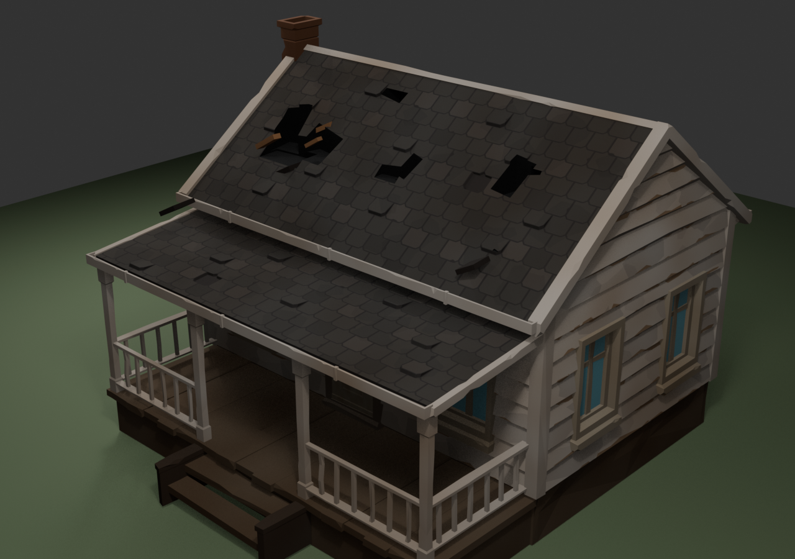
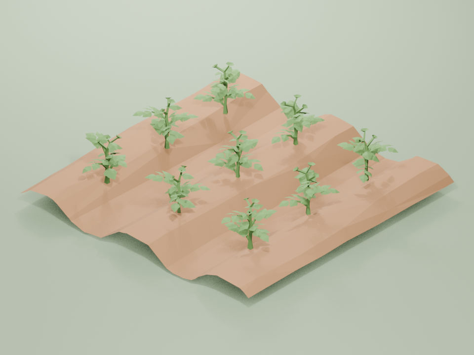
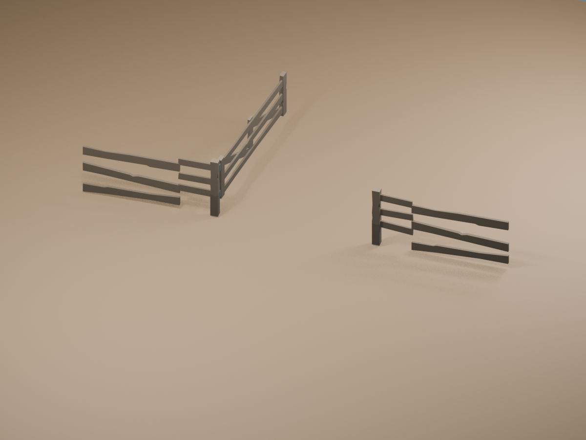

# 수뢰둔 H 시각 자료 대장

이 문서는 수뢰둔 캠페인의 효별 기획서가 같은 H 시각 후보를 중복 복제하지 않고 안정 ID로 참조하게 하는 공용 대장이다. 원본 대장은 `eng/execution-ledgers/hex03-h-visual-catalog.json`이다.

## H1 단품

| 안정 ID | 용도 | 휴대용 검토 이미지 | 상태 |
| --- | --- | --- | --- |
| `h1-stock:farm-residential-home` | 체류·관리·수리·회복 거점 |  | Blender 검증 사본 |
| `h1-stock:farm-production` | 2.5m x 2.5m 감자 경작 구획 |  | E4 시각 후보 |
| `h1-stock:farm-fence-edge` | 손상 수리·출입 병목·방어 경계 |  | E4 시각 후보 |
| `h1-stock:nature-incident-trace` | 흔적 조사 | 기존 H 정의 재사용 | 정의만 결속 |
| `h1-stock:nature-emergency-retreat` | 무리한 추적 중단·후퇴 | 기존 H 정의 재사용 | 정의만 결속 |

## H2 시각 구성 — 미정

H2의 의미 정의와 안정 ID는 호환을 위해 유지하지만, 현재 조립 이미지는 품질 기준을 충족하지 못해 채택하지 않는다. 새 시안을 별도로 검토하기 전까지 세 H2 모두 `VisualUndecided`다.

- `h2-candidate:forest-edge-living-farm`
- `h2-candidate:nature-threat-response`
- `h2-candidate:farm-boundary-defense-recovery`

기존 PNG와 Blender 초안 경로는 원본 대장의 `historyRefs`에만 남긴다. 현행 기획 문서·생성 색인·개발 준비 판정에서는 시각 후보로 표시하지 않는다.

## H3 캠페인 시각 구성 — 미정

`h3-candidate:forest-edge-living-farm-campaign`의 의미 정의는 유지한다. 다만 H2 시각 구성이 확정되지 않았으므로 H3 캠페인 경관도 `VisualUndecided`이며, 기존 조감도는 현행 후보가 아니다.

## 증거 경계

- 위 PNG는 기획 검토를 위한 저장소 사본이며 Runtime 자산이 아니다.
- Synty 원본 FBX나 `.blend`는 저장소로 복사하지 않았다.
- 현행 채택 범위는 위 H1 단품 세 건뿐이다. 이미지가 없는 H1 두 건은 정의만 결속한다.
- H2는 새 조립 시안을 사용자와 다시 검토해 확정하며, H3는 H2 확정 뒤 검토한다.
- 실제 Prefab, Renderer, Collider, Bounds, 지면 접지, 통행, WI 발현은 Presentation E5에서 별도로 검증한다.
- AnimationClip·전이·중단·귀환은 E6 범위다.
