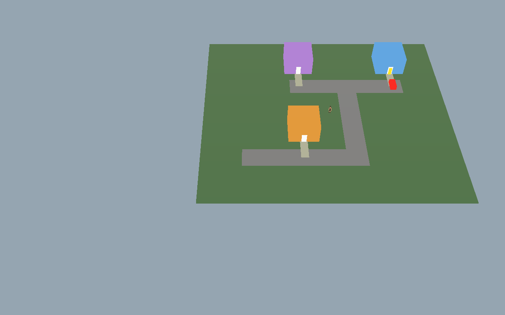

# 가상 동네 — 공간 기준·실행 관찰 통합 r2

- 연구 ID: `study:synthetic-delivery-observer-spatial.r2`
- 상태: `Accepted` — 아래 다중 기사 점유·대기 방향 승인. 구현·E 승격 상태가 아니다.
- 승인 근거: 2026-09-07 사용자가 기사 3명 비교·기존 배차 판단 순서 유지 계획의 구현을 요청하고, 이어서 “점유된 구간에서는 뒷차량이 기다리고 출입구도 한 명씩 사용하는 방식”과 기존 공간 연구·Play Mode 캡처 통합을 명시적으로 승인했다.
- 관계: [공간 연구 r1](synthetic-spatial-study.r1.md)의 기본 도형·미터 좌표·건물/출입구·속도 기준을 계승한다. 차량 1대 전용 제한은 아래 다중 기사 점유 규칙으로 대체한다. r1 파일·hash·당시 승인 및 실행 증거는 보존한다.
- 현행 실행 코드는 아직 r1 단일 기사다. r2 작업 명세·hash 재결속과 구현은 별도이며 기존 r1 명세를 r2 구현 완료로 간주하지 않는다.

## 실제 실행에서 확인한 것

공식 `SimulationWorldShell`에서 합성 프로필을 선택하고 Play Mode에 진입한 뒤 화면의 재생 버튼을 직접 눌렀다. 첫 주문은 Tick10 픽업, Tick27 전달, Tick28 수령 확인을 거쳤으며 Tick36에는 기사가 복귀 중이다. 두 번째 주문은 픽업 대기였다. 이후 배달 재생과 Editor를 일시정지했다.

주황색 음식점, 파랑·보라 주택, 회색 도로, 흰 출입구, 빨간 차량, 노란 기사로 구별한 실제 Game View 카메라 캡처다. 이 캡처에는 OnGUI 패널이 포함되지 않는다. [UI·Console을 포함한 실제 Editor 원본](../../../../assets/changes/2026-09-07-synthetic-delivery/editor.png)을 함께 보존한다. 이미지를 재생성하거나 오류를 가려 편집하지 않았다.

로컬 상세 증거: `artifacts/local/validation/delivery-play-runtime-final.json`, `delivery-play-console.json`. 사용자별 로컬 산출물이므로 다른 checkout에 존재한다고 가정하지 않는다. [구현 결과](runtime-result.r1.md)의 Core·EditMode 시험과 이번 실제 입력·화면 관찰은 서로 다른 증거다.

### 발견 사항과 다음 구현 책임

| 발견 | 확인 수준 | 반영할 작업 |
| --- | --- | --- |
| 첫 주문의 픽업·전달·수령·복귀 진행 | 실제 입력·상태 사본·화면 | r1 회귀 기준으로 보존 |
| 기사 1명·고정 경로로 후보 경쟁이 보이지 않음 | 코드·실행 | r2 기사 3명과 후보 비교 카드 |
| 상태 패널 잘림, 다른 업무 UI 혼입 | 실제 Editor 화면 | 합성 프로필 UI 분리와 화면 비율 대응 |
| Hub 입고·Nature 탐색·일일 작업 서버 연결 오류 | Console | 합성 프로필에서 무관한 운영 초기화 분리; 오류 자체를 숨기지 않음 |
| 출입구·도로의 복수 기사 경합 | 현재 미구현·미검증 | 아래 점유·대기 규칙 구현 및 재캡처 |

이번 관찰은 두 주문 완주, 복귀 완료, 365 Tick 전체 실행, 실제 저장 재진입, Hosted 연결, 충돌 회피 또는 E7 전체 통과 증거가 아니다. 기본 도형은 최종 시각 품질이나 실제 면목동 지리를 뜻하지 않는다.

## 승인된 다중 기사 공간 규칙

- 음식점 1곳·주택 2곳을 유지하고 NPC 기사 3명을 비교한다. 차량·보행 속도와 기존 건물·출입구 좌표는 r1 기준을 유지한다.
- 도로는 명시된 구간별로 점유한다. 점유된 구간으로 진입하려는 차량은 진입 전 유효한 대기 위치에서 기다린다. 맞은편 진입도 같은 구간의 점유를 존중한다. 겹침·순간이동·암묵적인 추월로 해결하지 않는다.
- 출입구는 한 번에 기사 한 명만 사용한다. 점유는 진입·인계·퇴장 후 해제까지 유지하며 다른 기사는 출입구 바깥에서 기다린다. 조리 전 도착한 기사의 대기도 점유 판정에 포함한다.
- 점유자·대기 순서·해제·재개는 Simulation Core가 소유한다. Unity Collider나 애니메이션 완료로 배차·인계를 확정하지 않는다. 저장·재생 시 대기와 점유 상태도 동일하게 복원해야 한다.
- 기존 도로 연결 지점과 음식점 정차 지점에서 차량이 서로 막거나 겹치지 않는지는 구현 전 배치 입력으로 검사한다. 기사별 초기 대기 위치, 교차점 확보와 순환 대기 방지 방식은 작업 명세에 결속하고 정적·Core 시험 후 실제 화면으로 확인한다. 이 연구만으로 그 검사를 통과했다고 선언하지 않는다.
- 배달권은 후보 검색 구역이고 도로 점유는 이동 제약이다. 둘을 같은 상태로 취급하지 않는다. 운영의 배차 판단 순서는 재사용하되 합성 권역은 실제 운영 권역과 구분한다.

## 이후 발견 사항의 통합 방식

이 기획에서는 실행 중 확인한 문제를 별도 대화에만 남기지 않고 이 공간·표현 기준의 후속 판본에 캡처·재현 조건·영향 WI·수정 상태·검증 범위와 함께 통합한다. 구현 결과와 기획 목차는 현행 판본을 연결한다. 해시가 결속된 과거 판본은 조용히 덮어쓰지 않는다.

승인된 의도 안의 오류 수정은 반복 승인을 요구하지 않고 진행·검증 결과를 기록한다. 새로운 공간·행동 선택이 필요한 경우에만 추가 결정을 받는다. 연구 기준, 코드 구현, 실제 화면, 저장/재생, 운영 연결은 계속 분리해서 표시한다.
