# Graph Map 계획 조회

> 이 문서는 파일 기반 계획 그래프의 생성 조회다. ReferenceAvailable은 기존 실제 E5 공간 사본의 식별자를 확인했다는 뜻이며, 이번 작업의 Unity Scene 배치·Play Mode 이동·입력·결과 또는 E5/E6 승격 증거가 아니다.

- 그래프 맵: graph-map:mirror:northern-life-hub-discovery.v1
- 판본: mirror-graph-map-plan.northern-life-hub-discovery.r13
- 원본: [eng/world-seedbeds/graph-maps/northern-life-hub-discovery.v1.json](../../../eng/world-seedbeds/graph-maps/northern-life-hub-discovery.v1.json)
- 원본 SHA-256: 55913f18daec11c884ccf62578cb1667d4ba8716f8a308d9986d3fcb93d2b18e
- 기준 공간 사본: simulation-world-actual-e5-spatial-output.r6 / AreaSet 4 / Graph 19 / 직접 결속 42
- 기준 WI: simulation-world-interactions.r48 / 133개
- federation: 하위 맵 7 / port 14 / connector 8
- 이동 능력 프로필: 6 / 오버레이 9
- 레이어: 6 / 엣지 효과 4 / 현행 기획 판정 59
- 배치 규칙: Area 프로필 5 / 기존 규칙 21 / 직접 결속 5 / 규칙 결속 제약 3
- 레벨 3 코드 결속: 6 / 소스 파일 13 / 실제 결속 미검증 대상 60
- 정규화 표본: 대상 9 / 관계 7 / 차단 1
- 이번 실제 Runtime 검증: false

## 한스 표본 — 기존 요소와 정규화 노드·엣지 비교

> 정규화 조회는 현행 레벨 1 요소를 삭제하지 않는다. CompatibilityAlias는 기존 안정 ID를 보존한 채 추출 관계를 가리키며, Blocked는 근거 부족을 숨기지 않는다.

| 기존 요소 | 정규화 대상 | 종류 | 이관 상태 | 호환 대상 |
| --- | --- | --- | --- | --- |
| gm-node:hans-permitted-tree | gm-node:hans-permitted-tree | WorldObject | Retained |  |
| gm-node:hans-broken-fence | gm-node:hans-broken-fence | WorldObject | Retained |  |
| gm-node:hans-first-trust, gm-node:hans-house-repair, gm-node:hans-mission-life-base | gm-node:hans | Actor | Reclassified |  |
| gm-node:hans-house-timber-stockpile | gm-node:hans-house-timber-stockpile | Resource | Reclassified |  |
| gm-node:hans-house-repair | gm-node:hans-house | WorldObject | Reclassified |  |
| gm-node:hans-mission-life-base | gm-node:hans-mission-life-base | Place | Reclassified |  |
| gm-node:hans-first-trust | gm-node:hans-first-trust | CompatibilityAlias | CompatibilityAlias | gm-node:hans, gm-edge:hans-normalized-witnesses-fence-repair |
| gm-node:hans-house-repair | gm-node:hans-house-repair | CompatibilityAlias | CompatibilityAlias | gm-node:hans-house, gm-edge:hans-normalized-repairs-house |
| gm-node:hans-managed-sword-clue | gm-node:hans-managed-sword-clue | WorldObject | Blocked |  |

| 정규화 엣지 | Actor | 대상 | WI | 상태 |
| --- | --- | --- | --- | --- |
| gm-edge:hans-normalized-harvests-permitted-tree Work | role:Player | gm-node:hans-permitted-tree | WI-NATURE-06, WI-NATURE-18 | RelationExtracted |
| gm-edge:hans-normalized-repairs-broken-fence Work | role:Player | gm-node:hans-broken-fence | WI-WORLD-04 | RelationExtracted |
| gm-edge:hans-normalized-witnesses-fence-repair Observation | gm-node:hans | gm-node:hans-broken-fence |  | RelationExtracted |
| gm-edge:hans-normalized-places-house-stockpile ResourcePlacement | role:Player | gm-node:hans-house-timber-stockpile | WI-NATURE-06, WI-NATURE-18 | RelationExtracted |
| gm-edge:hans-normalized-discovers-house-stockpile Observation | gm-node:hans | gm-node:hans-house-timber-stockpile | WI-NATURE-06, WI-NATURE-18 | RelationExtracted |
| gm-edge:hans-normalized-repairs-house StateTransition | gm-node:hans | gm-node:hans-house |  | RelationExtracted |
| gm-edge:hans-normalized-grants-life-base-permission PermissionGrant | gm-node:hans | gm-node:hans-mission-life-base |  | RelationExtracted |

### 일곱 칸 복원

| 관계 | 지금 | 여기 | 나 | 너 | 이렇게 | 결과 | 다음 선택 |
| --- | --- | --- | --- | --- | --- | --- | --- |
| gm-edge:hans-normalized-harvests-permitted-tree | 춘분 농장의 망가진 울타리를 발견한 뒤이며 정확 시각은 미정이다. | 농장 경계 밖의 가까운 채취 허용 구역이지만 정확 위치와 거리는 미정이다. | 의뢰나 보상을 받기 전에 자발적으로 돕기로 선택한 모험가 | 채취 권한이 확인된 나무 한 그루와 벌목으로 생기는 목재 | 기존 벌목·통나무 획득 WI를 사용하되 권한과 실제 자원 소비를 보존한다. | 벌목 대상은 소모되고 같은 원인 계보의 목재가 운반 가능한 상태가 된다. | 목재를 울타리로 운반, 작업 중단·복귀, 권한 미확인 시 벌목 보류 |
| gm-edge:hans-normalized-repairs-broken-fence | 허용 나무 벌목과 목재 획득 뒤이며 수리 시간·횟수는 미정이다. | Nature와 Farm이 맞닿는 망가진 울타리 구간이며 정확 구간은 미정이다. | 시간·체력·도구 내구도·목재 비용을 부담해 무보수로 수리하는 모험가 | 망가진 울타리, 운반한 목재, 수리에 필요한 도구 | 기존 시설 수리 WI 후보를 재사용하되 벌목 목재와 수리 결과를 같은 원인 계보로 잇는다. | 울타리의 회복 가능한 손상이 실제로 수리되고 별도 의뢰 보수는 생성되지 않는다. | 한스의 목격 결과 확인, 침입 흔적 공동 조사, 다른 생활 행동으로 복귀 |
| gm-edge:hans-normalized-witnesses-fence-repair | 벌목·운반·수리 과정이 끝나기 전후이며 별도 즉시 호감 보상 시점이 아니다. | 한스가 벌목부터 울타리 수리까지 직접 볼 수 있는 Farm 경계 | 대가를 요구하지 않고 생활 위험을 줄인 행동을 완료한 모험가 | 행동 전 과정을 목격한 한스와 첫 신뢰 관계 | 결과 전달만이 아니라 동일 원인 계보의 벌목·목재·수리 기록과 한스의 직접 목격을 대조한다. | 첫 신뢰의 시작을 기록하되 즉시 호감 수치·선물·의뢰 보상을 만들지 않는다. | 한스와 침입 흔적 공동 조사, 반복 협력, 생활 정보·증언으로 이어짐 |
| gm-edge:hans-normalized-places-house-stockpile | 첫 울타리 수리와 신뢰가 성립한 뒤의 별도 선택이며 한스의 발견은 플레이어가 떠난 뒤다. | 한스 집 옆의 통행·화재·출입구를 침범하지 않는 지정 적재 후보 지점이며 정확 위치는 미정이다. | 추가 보상이나 반복 신뢰를 요구하지 않고 허용 나무를 더 베어 운반할지 선택하는 모험가 | 실제로 남아 있는 여분 목재와 한스의 생활 동선 | 추가 벌목·운반·적재를 직접 수행하고 떠난 뒤, 한스가 해당 지점에 접근해 남은 목재를 발견한다. | 목재의 실제 종류·수량·상태만 후속 생활 재료 후보가 되며 원격 인지나 즉시 호감은 생기지 않는다. | 추가 적재 없이 떠남, 한스의 사후 발견·사용, 다른 생활 행동으로 복귀 |
| gm-edge:hans-normalized-discovers-house-stockpile | 첫 울타리 수리와 신뢰가 성립한 뒤의 별도 선택이며 한스의 발견은 플레이어가 떠난 뒤다. | 한스 집 옆의 통행·화재·출입구를 침범하지 않는 지정 적재 후보 지점이며 정확 위치는 미정이다. | 추가 보상이나 반복 신뢰를 요구하지 않고 허용 나무를 더 베어 운반할지 선택하는 모험가 | 실제로 남아 있는 여분 목재와 한스의 생활 동선 | 추가 벌목·운반·적재를 직접 수행하고 떠난 뒤, 한스가 해당 지점에 접근해 남은 목재를 발견한다. | 목재의 실제 종류·수량·상태만 후속 생활 재료 후보가 되며 원격 인지나 즉시 호감은 생기지 않는다. | 추가 적재 없이 떠남, 한스의 사후 발견·사용, 다른 생활 행동으로 복귀 |
| gm-edge:hans-normalized-repairs-house | 한스가 여분 목재를 실제 발견·사용하고 수리 경과가 진행된 뒤이며 정확 작업 시간은 미정이다. | 한스의 생활공간인 Farmhouse와 주변 통행·적재·공사 구역 | 재방문 이동 중 변화된 지붕·벽·문·비계·목재를 먼저 관찰하고 후속 표식을 선택할 수 있는 모험가 | 수리 필요→목재 확보→수리 중→수리됨 상태의 한스 집과 !/? 표식 | 권위 수리 상태를 표현 판본으로 읽고, 실제로 열린 의미에 맞는 표식만 선택한다. | 집의 큰 외형 변화와 목재 소비 계보를 읽지만 표현이나 표식이 수리·보상·관계를 만들지 않는다. | 한스의 ! 확인 대화, 실제로 열린 일반·메인 의뢰, 계속 이동 |
| gm-edge:hans-normalized-grants-life-base-permission | 수리된 집 관찰과 한스의 ! 확인 대화에서 이용 허락이 성립한 뒤 | Nature·Farm 인근 한스 생활공간 안의 허용된 휴식·소량 물자·준비 범위 | 경비대 임무 전후에 잠시 쉬고 정보를 확인하며 다음 이동을 준비하는 모험가 | 안전 판정, 한스의 허락, 제한된 생활공간·재고와 주변 임무 정보 | 허용 범위에서 휴식·기본 회복·소량 정리·동행대 준비를 하고 임무 승인·완료·보급은 별도 권위 기록에서 확인한다. | 첫 작은 생활 거점이 열리지만 경비대 지휘소·무제한 창고·무료 치료소·플레이어 소유 주택이 되지 않는다. | Nature·Farm 경비 임무로 출발, 한스와 생활 대화, 다른 거점·지역으로 이동 |

### 레벨 2 제약과 레벨 3 결속·미결속

| 관계 | 레벨 2 제약 | 레벨 3 대상 | 현재 결속 상태 |
| --- | --- | --- | --- |
| gm-edge:hans-normalized-harvests-permitted-tree | gm-constraint:hans-first-trust-spatial-values-unresolved | gm-node:hans-permitted-tree, gm-edge:farm-edge-to-hans-permitted-tree | gm-node:hans-permitted-tree=NoApprovedUnityBinding, gm-edge:farm-edge-to-hans-permitted-tree=NoApprovedUnityBinding |
| gm-edge:hans-normalized-repairs-broken-fence | gm-constraint:hans-first-trust-causal-lineage | gm-node:hans-broken-fence, gm-edge:hans-timber-to-fence-repair | gm-node:hans-broken-fence=NoApprovedUnityBinding, gm-edge:hans-timber-to-fence-repair=NoApprovedUnityBinding |
| gm-edge:hans-normalized-witnesses-fence-repair | gm-constraint:hans-first-trust-causal-lineage | gm-node:hans-first-trust, gm-edge:hans-fence-repair-to-first-trust | gm-node:hans-first-trust=NoApprovedUnityBinding, gm-edge:hans-fence-repair-to-first-trust=NoApprovedUnityBinding |
| gm-edge:hans-normalized-places-house-stockpile | gm-constraint:hans-axe-choice-and-optional-stockpile | gm-node:hans-house-timber-stockpile, gm-edge:hans-first-trust-to-house-stockpile | gm-node:hans-house-timber-stockpile=NoApprovedUnityBinding, gm-edge:hans-first-trust-to-house-stockpile=NoApprovedUnityBinding |
| gm-edge:hans-normalized-discovers-house-stockpile | gm-constraint:hans-house-repair-state-and-marker | gm-node:hans-house-timber-stockpile, gm-edge:hans-house-stockpile-to-repair | gm-node:hans-house-timber-stockpile=NoApprovedUnityBinding, gm-edge:hans-house-stockpile-to-repair=NoApprovedUnityBinding |
| gm-edge:hans-normalized-repairs-house | gm-constraint:hans-house-repair-state-and-marker, gm-constraint:hans-house-damage-candidate-tool-blocked | gm-node:hans-house-repair, gm-edge:hans-house-stockpile-to-repair | gm-node:hans-house-repair=NoApprovedUnityBinding, gm-edge:hans-house-stockpile-to-repair=NoApprovedUnityBinding |
| gm-edge:hans-normalized-grants-life-base-permission | gm-constraint:hans-life-base-boundary-unresolved | gm-node:hans-mission-life-base, gm-edge:hans-house-repair-to-life-base | gm-node:hans-mission-life-base=NoApprovedUnityBinding, gm-edge:hans-house-repair-to-life-base=NoApprovedUnityBinding |

## 규모 계층 — 하위 맵과 연결 포트

| 하위 맵 | 책임 | 노드 | 내부 엣지 | 제약 | 포트 |
| --- | --- | ---: | ---: | ---: | ---: |
| gm-subgraph:nature-discovery Nature 발견·Farm 경계 | NatureWorldPlanning / AreaBoundary | 14 | 13 | 9 | 3 |
| gm-subgraph:hans-precision-axe 한스 정밀 작업 도끼 발견·수리·반환 | NatureStoryPlanning / OptionalItemLineage | 3 | 2 | 2 | 1 |
| gm-subgraph:farm-production Farm 생산·집하·상차 | FarmWorldPlanning / IndependentArea | 3 | 2 | 1 | 2 |
| gm-subgraph:hub-logistics Hub 입고·차량·출고 | HubWorldPlanning / IndependentArea | 11 | 11 | 6 | 3 |
| gm-subgraph:regional-route-control 지역 장거리 경로 통제·중계 | RegionalRoutePlanning / OptionalExternalRoute | 1 | 0 | 2 | 2 |
| gm-subgraph:town-life Town 시장·생활 | TownWorldPlanning / IndependentArea | 4 | 3 | 1 | 1 |
| gm-subgraph:yodong-gateway 요동성 방비 관문 | YodongPlanning / UnresolvedExternal | 3 | 2 | 1 | 2 |

| connector | from → to | Graph Map 엣지 | 필요 능력 | 상태 |
| --- | --- | --- | --- | --- |
| gm-connector:nature-farm | gm-port:nature-farm-edge:to-farm → gm-port:farm-production:from-nature | gm-edge:farm-edge-to-production | Discovery | ReferenceAvailable |
| gm-connector:farm-hub | gm-port:farm-loading:to-hub → gm-port:hub-receiving:from-farm | gm-edge:farm-loading-to-hub-receiving | Cargo | ReferenceAvailable |
| gm-connector:hub-town | gm-port:hub-outbound:to-town → gm-port:town-market:from-hub | gm-edge:hub-outbound-to-town-receiving | Cargo, TownMarket | ReferenceAvailable |
| gm-connector:farm-threat-hostile-network | gm-port:farm-deeper-threat:to-hostile-network → gm-port:hostile-network:from-farm-threat | gm-edge:deeper-threat-gateway-to-hostile-network | ExternalUnresolved | Unresolved |
| gm-connector:hans-fence-precision-axe | gm-port:hans-broken-fence:to-precision-axe → gm-port:hans-broken-farm-axe:from-fence | gm-edge:hans-broken-fence-to-broken-farm-axe-storage | Discovery | Unresolved |
| gm-connector:hub-yodong | gm-port:hub-outbound:to-yodong → gm-port:yodong:from-hub | gm-edge:hub-outbound-to-yodong-gateway | ExternalUnresolved | Unresolved |
| gm-connector:hub-controlled-relay | gm-port:hub-outbound:to-yodong → gm-port:controlled-relay:from-hub | gm-edge:hub-outbound-to-controlled-relay | ExternalUnresolved | Unresolved |
| gm-connector:controlled-relay-yodong | gm-port:controlled-relay:to-yodong → gm-port:yodong:from-hub | gm-edge:controlled-relay-to-yodong-gateway | ExternalUnresolved | Unresolved |

## 레벨 2 — 기존 배치 구조·제약 규칙 결속

> 아래 규칙은 기존 H5 배치 정책을 판본째 참조한다. AvailableNotSelected는 규칙이 존재하지만 현재 Graph Map의 노드·엣지 제약에 아직 선택되지 않았다는 뜻이며, 통과나 실제 배치를 의미하지 않는다.

| Area | Graph 포함 | 규칙 | 사용 상태 | Graph 제약 |
| --- | --- | --- | --- | --- |
| NatureHome area-set:sim:pyeongchang:nature-home.v1 | Present | gm-placement-rule:nature:irregular-terrain IrregularTerrain | AvailableNotSelected |  |
| NatureHome area-set:sim:pyeongchang:nature-home.v1 | Present | gm-placement-rule:nature:low-building-density LowBuildingDensity | AvailableNotSelected |  |
| NatureHome area-set:sim:pyeongchang:nature-home.v1 | Present | gm-placement-rule:nature:threat-outer-ring ThreatOuterRing | AvailableNotSelected |  |
| NatureHome area-set:sim:pyeongchang:nature-home.v1 | Present | gm-placement-rule:nature:woodland-clearing-core WoodlandClearingCore | AvailableNotSelected |  |
| Farm area-set:sim:pyeongchang:farm-production.v1 | Present | gm-placement-rule:farm:crossroad-four-fields CrossroadFourFields | AvailableNotSelected |  |
| Farm area-set:sim:pyeongchang:farm-production.v1 | Present | gm-placement-rule:farm:fence-continuity-with-entrances FenceContinuityWithEntrances | AvailableNotSelected |  |
| Farm area-set:sim:pyeongchang:farm-production.v1 | Present | gm-placement-rule:farm:gentle-work-slope GentleWorkSlope | AvailableNotSelected |  |
| Farm area-set:sim:pyeongchang:farm-production.v1 | Present | gm-placement-rule:farm:no-ridge-building NoRidgeBuilding | AvailableNotSelected |  |
| Farm area-set:sim:pyeongchang:farm-production.v1 | Present | gm-placement-rule:farm:production-processing-separation ProductionProcessingSeparation | BoundToGraphConstraint | gm-constraint:farm-flow-separation |
| Hub area-set:sim:pyeongchang:logistics-hub.v1 | Present | gm-placement-rule:hub:flat-hardscape FlatHardscape | AvailableNotSelected |  |
| Hub area-set:sim:pyeongchang:logistics-hub.v1 | Present | gm-placement-rule:hub:vehicle-turning-radius VehicleTurningRadius | BoundToGraphConstraint | gm-constraint:route-capability-separation |
| Hub area-set:sim:pyeongchang:logistics-hub.v1 | Present | gm-placement-rule:hub:inbound-inspection-putaway-sequence InboundInspectionPutawaySequence | BoundToGraphConstraint | gm-constraint:hub-entry-contact-exit |
| Hub area-set:sim:pyeongchang:logistics-hub.v1 | Present | gm-placement-rule:hub:outbound-staging-separation OutboundStagingSeparation | BoundToGraphConstraint | gm-constraint:hub-entry-contact-exit |
| Town area-set:sim:pyeongchang:town-market.v1 | Present | gm-placement-rule:town:low-rise-mixed-use LowRiseMixedUse | AvailableNotSelected |  |
| Town area-set:sim:pyeongchang:town-market.v1 | Present | gm-placement-rule:town:pedestrian-market-spine PedestrianMarketSpine | AvailableNotSelected |  |
| Town area-set:sim:pyeongchang:town-market.v1 | Present | gm-placement-rule:town:resident-need-return-route ResidentNeedReturnRoute | AvailableNotSelected |  |
| Town area-set:sim:pyeongchang:town-market.v1 | Present | gm-placement-rule:town:service-traffic-control ServiceTrafficControl | BoundToGraphConstraint | gm-constraint:route-capability-separation |
| City area-set:sim:pyeongchang:city-service.v1 | OutsideCurrentGraph | gm-placement-rule:city:dense-service-grid DenseServiceGrid | OutsideCurrentGraph |  |
| City area-set:sim:pyeongchang:city-service.v1 | OutsideCurrentGraph | gm-placement-rule:city:large-service-facilities LargeServiceFacilities | OutsideCurrentGraph |  |
| City area-set:sim:pyeongchang:city-service.v1 | OutsideCurrentGraph | gm-placement-rule:city:public-space-network PublicSpaceNetwork | OutsideCurrentGraph |  |
| City area-set:sim:pyeongchang:city-service.v1 | OutsideCurrentGraph | gm-placement-rule:city:reserved-until-actual-e5 ReservedUntilActualE5 | OutsideCurrentGraph |  |

| Graph 제약 | 분류 | 기존 배치 규칙 | 경계 |
| --- | --- | --- | --- |
| gm-constraint:actual-reference-identity | GovernanceOnly | 없음 | 실제 참조 계보 검사이며 장소별 H5 배치 규칙을 적용하는 제약이 아니다. |
| gm-constraint:required-traversal-return | GovernanceOnly | 없음 | 필수 이동의 귀환 토폴로지를 검사하며 특정 Area의 배치 코드로 대체하지 않는다. |
| gm-constraint:unresolved-never-verified | GovernanceOnly | 없음 | 미해결 증거의 승격을 막는 관리 제약이다. |
| gm-constraint:farm-flow-separation | PlacementRuleBound | gm-placement-rule:farm:production-processing-separation | 기존 H5 규칙의 식별·적용 범위만 결속 |
| gm-constraint:first-logging-reflection-lineage | GovernanceOnly | 없음 | 첫 벌목 ActionRecord·한스 집 안전 휴식·성찰 진행·기존 성장 근거의 계보를 검사하는 상태 관문이며 장소별 H5 배치 수치를 만들지 않는다. |
| gm-constraint:hans-first-trust-causal-lineage | GovernanceOnly | 없음 | 벌목·목재·수리·목격·첫 신뢰의 원인 계보를 보존하는 기획 제약이며 장소별 H5 배치 수치를 만들지 않는다. |
| gm-constraint:hans-first-trust-spatial-values-unresolved | GovernanceOnly | 없음 | 미정 나무·거리·울타리·도구·관계 값을 실제 배치로 승격하지 못하게 하는 기획 관문이다. |
| gm-constraint:hans-axe-choice-and-optional-stockpile | GovernanceOnly | 없음 | 손도끼 사용과 여분 목재 적재를 별도 선택·원인 계보로 보존하는 기획 제약이며 장소별 H5 수치를 만들지 않는다. |
| gm-constraint:hans-precision-axe-repair-lineage | GovernanceOnly | 없음 | 부러진 농장 손도끼의 동일 개체·관계·재료·시간·맡김·반환 계보를 보존하는 기획 제약이며 실제 수리 기능이나 배치 규칙이 아니다. |
| gm-constraint:hans-precision-axe-role-separation | GovernanceOnly | 없음 | 개인 손도끼와 정밀 목공·수리 도구의 역할을 분리하는 기획 제약이며 성능·Prefab·한스 과거를 확정하지 않는다. |
| gm-constraint:route-layer-evidence-freshness | GovernanceOnly | 없음 | 경로 레이어의 근거·판본·관측·신선도를 검사하는 비배치 거버넌스 제약이다. |
| gm-constraint:route-cost-contribution-no-double-count | GovernanceOnly | 없음 | 레이어 비용 원인의 중복 합산을 막는 비배치 조합 제약이다. |
| gm-constraint:route-network-state-and-capacity-separation | GovernanceOnly | 없음 | 엣지 상태·망 차단·용량 부족을 분리하는 계획 제약이며 실제 경로 값을 만들지 않는다. |
| gm-constraint:route-encounter-authority-and-return | GovernanceOnly | 없음 | 실제 위험 원천과 우회·귀환을 요구하는 계획 제약이며 몬스터나 경로를 배치하지 않는다. |
| gm-constraint:hans-house-repair-state-and-marker | GovernanceOnly | 없음 | 한스의 사후 발견·목재 소비·수리 상태·표식 의미를 보존하는 기획·표현 관문이며 배치 규칙을 새로 정의하지 않는다. |
| gm-constraint:hans-house-damage-candidate-tool-blocked | GovernanceOnly | 없음 | 원본 불변 Blender 복사본 후보와 현재 도구 차단을 E4 후보 경계로 남기며 실제 자산 제작·배치 규칙이 아니다. |
| gm-constraint:hans-life-base-boundary-unresolved | GovernanceOnly | 없음 | 한스 허락 뒤 제한 생활 거점의 역할과 미정 값을 보존하며 경비대 지휘소나 플레이어 소유 주택 배치 규칙을 만들지 않는다. |
| gm-constraint:hub-circulation-registration-inspection-completion | GovernanceOnly | 없음 | Hub 업무 순서와 완료 권위를 보존하는 기획 제약이며 H1 좌표나 배치 수치를 새로 만들지 않는다. |
| gm-constraint:hub-outbound-required-inputs | GovernanceOnly | 없음 | 출고 전 업무 입력과 대기 상태를 검증하는 권위 제약이며 물리 배치를 확정하지 않는다. |
| gm-constraint:cargo-split-lineage-controlled-relay | GovernanceOnly | 없음 | 화물 분할·합류·회수 계보를 보존하는 업무 제약이며 중계 거점의 실제 위치를 만들지 않는다. |
| gm-constraint:hub-multimodal-lane-transshipment | GovernanceOnly | 없음 | 운송 수단별 차로·설비 분리가 필요하다는 기획 관문이며 정확 폭·회전 반경·설비 배치는 아직 미정이다. |
| gm-constraint:relay-capability-risk-not-hard-gate | GovernanceOnly | 없음 | 운송대 역량과 중계 권고의 판정 경계이며 중계소를 실제 공간에 배치하는 규칙이 아니다. |
| gm-constraint:road-stable-id-versioned-upgrade-choice | GovernanceOnly | 없음 | 같은 도로 안정 ID의 선택형 판본 승격을 보존하며 현재 도로 형상이나 공사 배치를 계산하지 않는다. |
| gm-constraint:roadwork-schedule-tradeoff | GovernanceOnly | 없음 | 공사 시간·비용·위험의 선택 대가를 보존하는 기획 제약이며 실제 공사 구간을 배치하지 않는다. |
| gm-constraint:roadwork-protection-resource-exclusivity | GovernanceOnly | 없음 | 동시간 보호 자원의 중복 배정을 막는 권위 제약이며 경비·조명 객체 배치를 자동 생성하지 않는다. |
| gm-constraint:hub-h4-external-areas-optional | GovernanceOnly | 없음 | 외부 Area를 필수 선행으로 만들지 않는 독립 개발 경계이며 새 Area나 연결 좌표를 생성하지 않는다. |
| gm-constraint:hub-entry-contact-exit | PlacementRuleBound | gm-placement-rule:hub:inbound-inspection-putaway-sequence, gm-placement-rule:hub:outbound-staging-separation | 기존 H5 규칙의 식별·적용 범위만 결속 |
| gm-constraint:route-capability-separation | PlacementRuleBound | gm-placement-rule:hub:vehicle-turning-radius, gm-placement-rule:town:service-traffic-control | 기존 H5 규칙의 식별·적용 범위만 결속 |
| gm-constraint:season-does-not-rewrite-topology | GovernanceOnly | 없음 | 시간·표현이 권위 토폴로지를 바꾸지 못하게 하는 경계다. |
| gm-constraint:asset-candidate-not-assignment | GovernanceOnly | 없음 | 자산 후보와 실제 할당의 증거 단계를 구분하는 표현 관문이다. |
| gm-constraint:no-whole-map-prerequisite | GovernanceOnly | 없음 | 영역 독립 개발 원칙이며 장소별 배치 규칙을 새 선행 조건으로 만들지 않는다. |
| gm-constraint:farm-patrol-return-and-ambiguity | GovernanceOnly | 없음 | 첫 순찰의 귀환과 위협 의미를 보존하며 아직 정해지지 않은 경로·거리·마수 배치를 만들지 않는다. |
| gm-constraint:hans-sword-delayed-reveal | GovernanceOnly | 없음 | 한스의 검을 지연 공개 단서로 보존하는 이야기 제약이며 실제 소품 배치 규칙이 아니다. |
| gm-constraint:hub-evidence-not-answer | GovernanceOnly | 없음 | 단서·가설·현장 확인의 인과를 보존하며 공간 배치나 정답 계산을 수행하지 않는다. |
| gm-constraint:hub-recovery-meditation-no-duplication | GovernanceOnly | 없음 | 회복·명상·영감 결과 중복을 막는 권위 경계이며 장소별 배치 규칙이 아니다. |
| gm-constraint:town-workshop-small-test-boundary | GovernanceOnly | 없음 | 작은 시험의 학습·보상 경계를 보존하며 공방 작업대나 자산을 자동 배치하지 않는다. |
| gm-constraint:hostile-division-requires-actual-separation | GovernanceOnly | 없음 | 실제 관계 차단 전 종합 역량 재판정을 막는 기획 제약이며 전장 배치 규칙이 아니다. |

## 레벨 1 — 플레이 관계

```mermaid
flowchart LR
    N0["Nature 숲길 입구"]
    N1["숲 가장자리·농장 외곽"]
    N2["Farm 생산 구역"]
    N3{{"한스 농장 경계의 허용 벌목 나무 후보<br/>미해결"}}
    N4{{"한스 농장의 망가진 울타리<br/>미해결"}}
    N5{{"한스의 직접 목격과 첫 신뢰<br/>미해결"}}
    N6{{"부러진 농장 손도끼 발견·보관<br/>미해결"}}
    N7{{"한스에게 정밀 작업 도끼 수리 맡김<br/>미해결"}}
    N8{{"수리된 정밀 작업 도끼 반환<br/>미해결"}}
    N9["첫 벌목 성찰 씨앗 준비"]
    N10{{"한스 집 옆 선택적 여분 목재 적재<br/>미해결"}}
    N11{{"한스 집 수리 전·중·후 변화<br/>미해결"}}
    N12{{"수리된 한스 집의 경비대 임무 생활 거점<br/>미해결"}}
    N13{{"Farm 경계 첫 순찰 준비<br/>미해결"}}
    N14{{"Farm 경계 동물형·야수형 마수 조우<br/>미해결"}}
    N15{{"비정상 이동·상처·영역 흔적 조사<br/>미해결"}}
    N16{{"Farm 경계 더 깊은 위협 관문<br/>미해결"}}
    N17{{"한스 집의 관리된 검 단서<br/>미해결"}}
    N18["Farm 작업마당"]
    N19["Farm 상차 관문"]
    N20["Hub 입고·보관 접점"]
    N21["Hub 차량 마당"]
    N22["Hub 출고 접점"]
    N23{{"Hub 차량·운송 수단 등록소<br/>미해결"}}
    N24{{"Hub 화물 검수·접수장<br/>미해결"}}
    N25{{"Hub 하역 대기장<br/>미해결"}}
    N26{{"Hub 창고 입출고장<br/>미해결"}}
    N27{{"장거리 중계·검문·안전 거점 후보<br/>미해결"}}
    N28{{"Hub 미도착 화물·단서 조사<br/>미해결"}}
    N29{{"미도착 화물 현장 확인<br/>미해결"}}
    N30{{"화물 문제 예방·NPC 안도·회복<br/>미해결"}}
    N31{{"Hub 사건 뒤 선택적 명상<br/>미해결"}}
    N32["Town 시장 입고 접점"]
    N33["Town 생활 광장"]
    N34{{"Town 견습 공방 실패 작업대 관찰<br/>미해결"}}
    N35{{"Town 견습과 작은 시험 batch<br/>미해결"}}
    N36{{"거대 마수·적대 조직 위협망<br/>미해결"}}
    N37{{"위협망 분할 대응<br/>미해결"}}
    N38{{"요동성 방비 외부 관문<br/>미해결"}}
    N0 <-->|Traversal| N1
    N1 <-->|DiscoverySightline| N2
    N1 -.->|WorkHandoff| N3
    N3 -.->|WorkHandoff| N4
    N4 -.->|WorkHandoff| N5
    N4 -.->|DiscoverySightline| N6
    N6 -.->|WorkHandoff| N7
    N7 -.->|WorkHandoff| N8
    N5 -.->|WorkHandoff| N10
    N10 -.->|WorkHandoff| N11
    N11 -.->|WorkHandoff| N12
    N12 -.->|WorkHandoff| N13
    N13 -.->|Traversal| N14
    N14 -.->|DiscoverySightline| N15
    N14 -.->|Traversal| N12
    N15 -.->|ExternalGateway| N16
    N12 -.->|DiscoverySightline| N17
    N2 <-->|WorkHandoff| N18
    N18 <-->|Logistics| N19
    N19 -->|Logistics| N20
    N20 -.->|WorkHandoff| N23
    N23 -.->|WorkHandoff| N24
    N24 -.->|WorkHandoff| N25
    N25 -.->|WorkHandoff| N26
    N26 -.->|Logistics| N21
    N20 <-->|Traversal| N21
    N21 <-->|WorkHandoff| N22
    N20 -.->|WorkHandoff| N28
    N28 -.->|Traversal| N29
    N29 -.->|WorkHandoff| N30
    N30 -.->|WorkHandoff| N31
    N22 -.->|ExternalGateway| N27
    N27 -.->|ExternalGateway| N38
    N22 -->|Logistics| N32
    N32 <-->|WorkHandoff| N33
    N33 -.->|DiscoverySightline| N34
    N34 -.->|WorkHandoff| N35
    N16 -.->|ExternalGateway| N36
    N36 -.->|WorkHandoff| N37
    N37 -.->|ExternalGateway| N38
    N22 -.->|ExternalGateway| N38
```

| 노드 | 역할 | 실현 상태 | WI | 실제 공간 참조 |
| --- | --- | --- | --- | --- |
| gm-node:nature-trailhead Nature 숲길 입구 | DiscoveryEntry | ExistingActualGraphRef / ReferenceAvailable | WI-NATURE-01, WI-NATURE-02 | landscape-graph:sim:pyeongchang:nature-trail-network.v1 node:actual-e5:nature-trail-network:space:nature-trail-shelter:nature-trailhead |
| gm-node:nature-farm-edge 숲 가장자리·농장 외곽 | NatureFarmThreshold | ExistingActualGraphRef / ReferenceAvailable | WI-NATURE-01, WI-NATURE-04 | landscape-graph:sim:pyeongchang:highland-farm.v1 node:actual-e5:highland-farm:space:forest-edge-farm:nature-farm-edge |
| gm-node:farm-production Farm 생산 구역 | CropProduction | ExistingActualGraphRef / ReferenceAvailable | WI-FARM-01, WI-FARM-02, WI-FARM-03, WI-FARM-04 | landscape-graph:sim:pyeongchang:highland-farm.v1 node:actual-e5:highland-farm:space:forest-edge-farm:farm-production |
| gm-node:hans-permitted-tree 한스 농장 경계의 허용 벌목 나무 후보 | PermittedTimberSource | UnresolvedSpatial / Unresolved | WI-NATURE-06, WI-NATURE-18 | 없음 |
| gm-node:hans-broken-fence 한스 농장의 망가진 울타리 | UnpaidFenceRepair | UnresolvedSpatial / Unresolved | WI-WORLD-04 | 없음 |
| gm-node:hans-first-trust 한스의 직접 목격과 첫 신뢰 | WitnessedFirstTrust | PlanningGateway / Unresolved |  | 없음 |
| gm-node:hans-broken-farm-axe-storage 부러진 농장 손도끼 발견·보관 | BrokenPrecisionAxeStorage | PlanningGateway / Unresolved |  | 없음 |
| gm-node:hans-precision-axe-repair-handoff 한스에게 정밀 작업 도끼 수리 맡김 | PrecisionAxeRepairHandoff | PlanningGateway / Unresolved |  | 없음 |
| gm-node:hans-repaired-precision-axe-return 수리된 정밀 작업 도끼 반환 | RepairedPrecisionAxeReturn | PlanningGateway / Unresolved |  | 없음 |
| gm-node:first-logging-reflection-preparation 첫 벌목 성찰 씨앗 준비 | FirstLoggingReflectionPreparation | ExistingPartialGraphRef / Planned | WI-NATURE-06 | 없음 |
| gm-node:hans-house-timber-stockpile 한스 집 옆 선택적 여분 목재 적재 | OptionalTimberStockpile | UnresolvedSpatial / Unresolved | WI-NATURE-06, WI-NATURE-18 | 없음 |
| gm-node:hans-house-repair 한스 집 수리 전·중·후 변화 | ObservedHouseRepairState | PlanningGateway / Unresolved |  | 없음 |
| gm-node:hans-mission-life-base 수리된 한스 집의 경비대 임무 생활 거점 | ConditionalMissionLifeBase | PlanningGateway / Unresolved |  | 없음 |
| gm-node:farm-boundary-patrol-preparation Farm 경계 첫 순찰 준비 | PatrolPreparation | PlanningGateway / Unresolved |  | 없음 |
| gm-node:farm-boundary-beast-encounter Farm 경계 동물형·야수형 마수 조우 | BeastEncounter | PlanningGateway / Unresolved |  | 없음 |
| gm-node:farm-boundary-trace-investigation 비정상 이동·상처·영역 흔적 조사 | ThreatTraceInvestigation | PlanningGateway / Unresolved |  | 없음 |
| gm-node:farm-deeper-threat-gateway Farm 경계 더 깊은 위협 관문 | FutureThreatGateway | PlanningGateway / Unresolved |  | 없음 |
| gm-node:hans-managed-sword-clue 한스 집의 관리된 검 단서 | OptionalIdentityClue | PlanningGateway / Unresolved |  | 없음 |
| gm-node:farm-work-yard Farm 작업마당 | HarvestCollectionAndPacking | ExistingActualGraphRef / ReferenceAvailable | WI-FARM-05, WI-FARM-06 | landscape-graph:sim:pyeongchang:farm-processing-campus.v1 node:actual-e5:farm-processing-campus:space:farm-wash-sort-pack:farm-work-yard |
| gm-node:farm-loading-gate Farm 상차 관문 | FarmCargoExit | ExistingActualGraphRef / ReferenceAvailable | WI-LOG-01, WI-LOG-02, WI-LOG-03 | landscape-graph:sim:pyeongchang:farm-processing-campus.v1 node:actual-e5:farm-processing-campus:space:farm-processing-shipping:farm-loading-gate |
| gm-node:hub-receiving-storage Hub 입고·보관 접점 | HubInboundContact | ExistingActualGraphRef / ReferenceAvailable | WI-LOG-04, WI-LOG-05, WI-HUB-03, WI-HUB-04 | landscape-graph:sim:pyeongchang:jinbu-hub.v1 node:actual-e5:jinbu-hub:space:hub-inbound-storage:hub-receiving-storage |
| gm-node:hub-vehicle-yard Hub 차량 마당 | HubObservationAndVehicleAccess | ExistingActualGraphRef / ReferenceAvailable | WI-HUB-06 | landscape-graph:sim:pyeongchang:hub-fulfillment-operations.v1 node:actual-e5:hub-fulfillment-operations:space:hub-outbound-vehicle:hub-vehicle-yard |
| gm-node:hub-outbound-staging Hub 출고 접점 | HubOutboundContact | ExistingActualGraphRef / ReferenceAvailable | WI-HUB-05, WI-HUB-06, WI-MARKET-01 | landscape-graph:sim:pyeongchang:hub-fulfillment-operations.v1 node:actual-e5:hub-fulfillment-operations:space:hub-outbound-vehicle:hub-outbound-staging |
| gm-node:hub-vehicle-registration Hub 차량·운송 수단 등록소 | HubVehicleRegistrationH1 | UnresolvedSpatial / Unresolved |  | 없음 |
| gm-node:hub-cargo-inspection Hub 화물 검수·접수장 | HubCargoInspectionH1 | UnresolvedSpatial / Unresolved |  | 없음 |
| gm-node:hub-unloading-waiting Hub 하역 대기장 | HubUnloadingWaitingH1 | UnresolvedSpatial / Unresolved |  | 없음 |
| gm-node:hub-warehouse-inbound-outbound Hub 창고 입출고장 | HubWarehouseInboundOutboundH1 | UnresolvedSpatial / Unresolved |  | 없음 |
| gm-node:route-controlled-relay 장거리 중계·검문·안전 거점 후보 | ControlledRelayCheckpointSafeH1 | PlanningGateway / Unresolved |  | 없음 |
| gm-node:hub-missing-cargo-investigation Hub 미도착 화물·단서 조사 | MissingCargoInvestigation | PlanningGateway / Unresolved |  | 없음 |
| gm-node:hub-missing-cargo-field-confirmation 미도착 화물 현장 확인 | HypothesisFieldConfirmation | PlanningGateway / Unresolved |  | 없음 |
| gm-node:hub-cargo-relief-recovery 화물 문제 예방·NPC 안도·회복 | CargoReliefAndRecovery | PlanningGateway / Unresolved |  | 없음 |
| gm-node:hub-optional-meditation Hub 사건 뒤 선택적 명상 | OptionalMeditationReflection | PlanningGateway / Unresolved |  | 없음 |
| gm-node:town-market-receiving Town 시장 입고 접점 | TownMarketInbound | ExistingActualGraphRef / ReferenceAvailable | WI-MARKET-02, WI-MARKET-03, WI-MARKET-04 | landscape-graph:sim:pyeongchang:town-market-fulfillment.v1 node:actual-e5:town-market-fulfillment:space:town-market-receiving:town-market-receiving |
| gm-node:town-living-square Town 생활 광장 | TownResidentContact | ExistingActualGraphRef / ReferenceAvailable | WI-MARKET-05, WI-ORDER-01, WI-ORDER-06 | landscape-graph:sim:pyeongchang:town-market-fulfillment.v1 node:actual-e5:town-market-fulfillment:space:market-life-commerce:town-living-square |
| gm-node:town-apprentice-workshop-failure Town 견습 공방 실패 작업대 관찰 | WorkshopFailureDiagnosis | PlanningGateway / Unresolved |  | 없음 |
| gm-node:town-apprentice-small-test-batch Town 견습과 작은 시험 batch | WorkshopSmallTestBatch | PlanningGateway / Unresolved |  | 없음 |
| gm-node:hostile-threat-network 거대 마수·적대 조직 위협망 | HostileThreatNetwork | PlanningGateway / Unresolved |  | 없음 |
| gm-node:hostile-divided-response 위협망 분할 대응 | DivideAndRespond | PlanningGateway / Unresolved |  | 없음 |
| gm-node:yodong-defense-gateway 요동성 방비 외부 관문 | FutureStoryGateway | PlanningGateway / Unresolved |  | 없음 |

| 엣지 | 종류·의도 | 이동 능력 | 상태 | 방향 | 이유 |
| --- | --- | --- | --- | --- | --- |
| gm-edge:nature-trail-to-farm-edge gm-node:nature-trailhead → gm-node:nature-farm-edge | Traversal / Required | gm-capability:walk-discovery | ReferenceAvailable | 양방향 | 발견 장면의 접근과 압박 없는 복귀를 함께 보존한다. |
| gm-edge:farm-edge-to-production gm-node:nature-farm-edge → gm-node:farm-production | DiscoverySightline / Optional | gm-capability:discovery-sightline | ReferenceAvailable | 양방향 | Farm을 발견해도 반드시 진입하거나 소유할 필요는 없다. |
| gm-edge:farm-edge-to-hans-permitted-tree gm-node:nature-farm-edge → gm-node:hans-permitted-tree | WorkHandoff / Optional | gm-capability:work-handoff | Unresolved | 단방향 | 망가진 울타리를 발견해도 벌목은 자동 시작되지 않으며 가까운 나무의 채취 권한을 먼저 확인한다. |
| gm-edge:hans-timber-to-fence-repair gm-node:hans-permitted-tree → gm-node:hans-broken-fence | WorkHandoff / Required | gm-capability:work-handoff | Unresolved | 단방향 | 벌목한 나무·생성 목재·운반·울타리 수리를 같은 원인 계보로 잇고 자원을 연출로 대체하지 않는다. |
| gm-edge:hans-fence-repair-to-first-trust gm-node:hans-broken-fence → gm-node:hans-first-trust | WorkHandoff / Required | gm-capability:work-handoff | Unresolved | 단방향 | 첫 신뢰는 수리 결과만 전해 듣는 것으로 성립하지 않고 한스가 벌목부터 무보수 수리까지 직접 목격해야 한다. |
| gm-edge:hans-broken-fence-to-broken-farm-axe-storage gm-node:hans-broken-fence → gm-node:hans-broken-farm-axe-storage | DiscoverySightline / Optional | gm-capability:discovery-sightline | Unresolved | 단방향 | 울타리 부근의 별도 부러진 농장 손도끼는 조사·보관할 수 있지만 개인 손도끼의 첫 벌목·울타리 수리를 대체하지 않는다. |
| gm-edge:broken-farm-axe-storage-to-repair-handoff gm-node:hans-broken-farm-axe-storage → gm-node:hans-precision-axe-repair-handoff | WorkHandoff / Optional | gm-capability:work-handoff | Unresolved | 단방향 | 한스 관계와 집 접근·도구 소지·재료·시간·명시적 맡김이 모두 확인될 때만 수리 후보를 연다. |
| gm-edge:precision-axe-repair-handoff-to-return gm-node:hans-precision-axe-repair-handoff → gm-node:hans-repaired-precision-axe-return | WorkHandoff / Optional | gm-capability:work-handoff | Unresolved | 단방향 | 수리 경과와 동일 개체 계보를 확인한 뒤 같은 정밀 작업 도끼만 반환하며 새 도끼·무상 반복 수리를 만들지 않는다. |
| gm-edge:hans-first-trust-to-house-stockpile gm-node:hans-first-trust → gm-node:hans-house-timber-stockpile | WorkHandoff / Optional | gm-capability:work-handoff | Unresolved | 단방향 | 여분 목재 적재는 첫 수리·신뢰와 분리된 선택이며 수행하지 않아도 이미 성립한 결과를 취소하지 않는다. |
| gm-edge:hans-house-stockpile-to-repair gm-node:hans-house-timber-stockpile → gm-node:hans-house-repair | WorkHandoff / Optional | gm-capability:work-handoff | Unresolved | 단방향 | 플레이어가 떠난 뒤 남아 있는 목재를 한스가 생활 동선에서 발견·사용하고 작업 경과가 있어야 집 표현이 바뀐다. |
| gm-edge:hans-house-repair-to-life-base gm-node:hans-house-repair → gm-node:hans-mission-life-base | WorkHandoff / Optional | gm-capability:work-handoff | Unresolved | 양방향 | 수리된 집을 관찰한 뒤 한스의 ! 확인 대화와 이용 허락이 있어야 제한된 생활 거점이 열린다. |
| gm-edge:hans-life-base-to-patrol-preparation gm-node:hans-mission-life-base → gm-node:farm-boundary-patrol-preparation | WorkHandoff / Optional | gm-capability:work-handoff | Unresolved | 양방향 | 생활 거점은 순찰 준비와 귀환을 지원하지만 순찰 참여를 강제하지 않는다. |
| gm-edge:patrol-preparation-to-beast-encounter gm-node:farm-boundary-patrol-preparation → gm-node:farm-boundary-beast-encounter | Traversal / Optional | gm-capability:walk-discovery | Unresolved | 양방향 | 출발 뒤 실제 경계 경로와 조우 조건이 성립해야 하며 준비 선택만으로 마수가 생성되지 않는다. |
| gm-edge:beast-encounter-to-trace-investigation gm-node:farm-boundary-beast-encounter → gm-node:farm-boundary-trace-investigation | DiscoverySightline / Optional | gm-capability:discovery-sightline | Unresolved | 단방향 | 현장이 안전하고 흔적이 실제 남은 경우에만 조사로 이어지며 조우 결과가 배후 정답을 만들지 않는다. |
| gm-edge:beast-encounter-return-to-life-base gm-node:farm-boundary-beast-encounter → gm-node:hans-mission-life-base | Traversal / Optional | gm-capability:walk-discovery | Unresolved | 양방향 | 대응을 포기하거나 중단해도 가능한 조건에서는 한스 생활 거점으로 안전 귀환할 선택을 보존한다. |
| gm-edge:trace-investigation-to-deeper-threat-gateway gm-node:farm-boundary-trace-investigation → gm-node:farm-deeper-threat-gateway | ExternalGateway / Optional | gm-capability:unresolved-external | Unresolved | 단방향 | 확인된 흔적만 장기 위협 조사 후보로 넘기며 첫 순찰 안에서 조직 전체를 펼치지 않는다. |
| gm-edge:hans-life-base-to-sword-clue gm-node:hans-mission-life-base → gm-node:hans-managed-sword-clue | DiscoverySightline / Optional | gm-capability:discovery-sightline | Unresolved | 단방향 | 검은 선택형 장기 단서이며 첫 순찰에서 한스가 사용하거나 정체를 공개하는 기능으로 연결하지 않는다. |
| gm-edge:farm-production-to-work-yard gm-node:farm-production → gm-node:farm-work-yard | WorkHandoff / Required | gm-capability:work-handoff | ReferenceAvailable | 양방향 | 수확 결과와 집하·포장 준비를 같은 공간으로 오인하지 않고 인계한다. |
| gm-edge:farm-work-yard-to-loading-gate gm-node:farm-work-yard → gm-node:farm-loading-gate | Logistics / Required | gm-capability:local-cargo | ReferenceAvailable | 양방향 | 작업마당·정비 여유·상차 관문을 순서 있는 화물 동선으로 읽는다. |
| gm-edge:farm-loading-to-hub-receiving gm-node:farm-loading-gate → gm-node:hub-receiving-storage | Logistics / Optional | gm-capability:inter-area-cargo | ReferenceAvailable | 단방향 | Farm과 Hub는 독립 실행을 유지하며 승인된 화물이 있을 때만 선택적으로 연결한다. |
| gm-edge:hub-receiving-to-vehicle-registration gm-node:hub-receiving-storage → gm-node:hub-vehicle-registration | WorkHandoff / Required | gm-capability:work-handoff | Unresolved | 단방향 | 기존 Hub 입고 접점은 실제 참조로 보존하고 세부 물류 순환은 등록 H1부터 별도 계획 계보로 시작한다. |
| gm-edge:hub-registration-to-cargo-inspection gm-node:hub-vehicle-registration → gm-node:hub-cargo-inspection | WorkHandoff / Required | gm-capability:work-handoff | Unresolved | 단방향 | 운송 수단 등록과 화물 검수는 서로 다른 H1이며 등록 성공이 화물 통과를 대신하지 않는다. |
| gm-edge:hub-inspection-to-unloading-waiting gm-node:hub-cargo-inspection → gm-node:hub-unloading-waiting | WorkHandoff / Required | gm-capability:work-handoff | Unresolved | 단방향 | 검수 통과 화물만 운송 수단별 하역 대기 순서와 설비 후보로 인계한다. |
| gm-edge:hub-unloading-to-warehouse gm-node:hub-unloading-waiting → gm-node:hub-warehouse-inbound-outbound | WorkHandoff / Required | gm-capability:work-handoff | Unresolved | 단방향 | 하역 대기와 창고 입출고·보관·환적 상태를 한 단계로 합치지 않는다. |
| gm-edge:hub-warehouse-to-vehicle-yard gm-node:hub-warehouse-inbound-outbound → gm-node:hub-vehicle-yard | Logistics / Required | gm-capability:inter-area-cargo | Unresolved | 단방향 | 적재 없음 또는 필수 출고 입력이 갖춰진 화물만 운송대 편성·차량 마당으로 넘어간다. |
| gm-edge:hub-receiving-to-vehicle-yard gm-node:hub-receiving-storage → gm-node:hub-vehicle-yard | Traversal / Required | gm-capability:walk-discovery | ReferenceAvailable | 양방향 | Hub의 입구·접점·출구를 한 화면에 뭉개지 않고 현장 이동과 광역 조회를 연결한다. |
| gm-edge:hub-vehicle-yard-to-outbound gm-node:hub-vehicle-yard → gm-node:hub-outbound-staging | WorkHandoff / Required | gm-capability:work-handoff | ReferenceAvailable | 양방향 | 차량 접근과 실제 출고 대기 상태를 분리한다. |
| gm-edge:hub-receiving-to-missing-cargo-investigation gm-node:hub-receiving-storage → gm-node:hub-missing-cargo-investigation | WorkHandoff / Optional | gm-capability:work-handoff | Unresolved | 양방향 | 예정과 실제 입고의 불일치가 확인될 때만 별도 사건 조사가 열리며 Hub 기본 입고 업무는 독립 실행을 유지한다. |
| gm-edge:missing-cargo-investigation-to-field-confirmation gm-node:hub-missing-cargo-investigation → gm-node:hub-missing-cargo-field-confirmation | Traversal / Optional | gm-capability:walk-discovery | Unresolved | 양방향 | 플레이어가 고른 가설과 근거를 현장 상태에 대조하며 틀린 가설이면 조사로 돌아갈 수 있다. |
| gm-edge:field-confirmation-to-relief-recovery gm-node:hub-missing-cargo-field-confirmation → gm-node:hub-cargo-relief-recovery | WorkHandoff / Optional | gm-capability:work-handoff | Unresolved | 단방향 | 확인된 원인과 실제 대응 결과만 NPC 안도·회복 후보에 인계한다. |
| gm-edge:relief-recovery-to-optional-meditation gm-node:hub-cargo-relief-recovery → gm-node:hub-optional-meditation | WorkHandoff / Optional | gm-capability:work-handoff | Unresolved | 단방향 | 명상은 회복 뒤의 선택이며 같은 결과를 다시 지급하거나 게임 진행을 막지 않는다. |
| gm-edge:hub-outbound-to-controlled-relay gm-node:hub-outbound-staging → gm-node:route-controlled-relay | ExternalGateway / Optional | gm-capability:unresolved-external | Unresolved | 단방향 | 중계·휴식은 권장 후보이며 충분한 수단·역량을 가진 운송대의 무정차 경로를 막지 않는다. |
| gm-edge:controlled-relay-to-yodong-gateway gm-node:route-controlled-relay → gm-node:yodong-defense-gateway | ExternalGateway / Optional | gm-capability:unresolved-external | Unresolved | 단방향 | 실제 목적지·좌표가 없는 상태에서 중계 H1을 거친 대체 경로 구조만 보존하며 요동성 결속을 확정하지 않는다. |
| gm-edge:hub-outbound-to-town-receiving gm-node:hub-outbound-staging → gm-node:town-market-receiving | Logistics / Optional | gm-capability:inter-area-cargo | ReferenceAvailable | 단방향 | Hub와 Town의 독립 업무를 유지하면서 확정된 출고만 운송 관계로 넘긴다. |
| gm-edge:town-receiving-to-living-square gm-node:town-market-receiving → gm-node:town-living-square | WorkHandoff / Optional | gm-capability:work-handoff | ReferenceAvailable | 양방향 | 후방 입고와 주민이 보는 시장·생활 접점을 구분한다. |
| gm-edge:town-living-square-to-apprentice-workshop-failure gm-node:town-living-square → gm-node:town-apprentice-workshop-failure | DiscoverySightline / Optional | gm-capability:discovery-sightline | Unresolved | 양방향 | Town 생활에서 공방 사건을 선택적으로 발견하며 Hub·Farm 완료를 입장 조건으로 만들지 않는다. |
| gm-edge:workshop-failure-to-small-test-batch gm-node:town-apprentice-workshop-failure → gm-node:town-apprentice-small-test-batch | WorkHandoff / Optional | gm-capability:work-handoff | Unresolved | 양방향 | 원인 후보 하나와 견습의 동의·소량 재료가 있을 때만 작은 시험으로 이어진다. |
| gm-edge:deeper-threat-gateway-to-hostile-network gm-node:farm-deeper-threat-gateway → gm-node:hostile-threat-network | ExternalGateway / Unknown | gm-capability:unresolved-external | Unresolved | 단방향 | 첫 Farm 순찰의 흔적이 장기 위협망과 실제로 연결되는지는 후속 기획·공간 증거 전까지 관문으로 남긴다. |
| gm-edge:hostile-network-to-divided-response gm-node:hostile-threat-network → gm-node:hostile-divided-response | WorkHandoff / Optional | gm-capability:work-handoff | Unresolved | 양방향 | 지휘·호위·지원·증원·회복·보급 중 실제 차단할 연결을 확인했을 때만 분할 대응을 선택한다. |
| gm-edge:divided-response-to-yodong-gateway gm-node:hostile-divided-response → gm-node:yodong-defense-gateway | ExternalGateway / Optional | gm-capability:unresolved-external | Unresolved | 단방향 | 실제 분리·대응 결과만 요동성 장기 방비 판단의 후보 입력이 되며 자동 승리나 E 승격을 만들지 않는다. |
| gm-edge:hub-outbound-to-yodong-gateway gm-node:hub-outbound-staging → gm-node:yodong-defense-gateway | ExternalGateway / Unknown | gm-capability:unresolved-external | Unresolved | 단방향 | 보급·제작·전투 기록이 요동성 방비에 이어지는 방향만 있으며 실제 공간·WI·경로는 아직 없다. |

### 이동 능력 프로필

| 프로필 | Actor | 화물 | 차량 | 권위 근거 | 귀환 정책 |
| --- | --- | --- | --- | --- | --- |
| gm-capability:walk-discovery 도보 발견·복귀 | Player, Npc | None | None | False | RequiredWhenTraversalIsRequired |
| gm-capability:discovery-sightline 시야 단서 기반 발견 | PlayerView | None | None | False | NotApplicable |
| gm-capability:work-handoff 작업 인계 | Player, Npc, Worker | HandCarryCandidate | None | True | WorkResultCanReturnToSource |
| gm-capability:local-cargo Area 내부 화물 이동 | Player, Npc, Worker | CargoRequired | OptionalCandidate | True | ReturnOrHoldRequired |
| gm-capability:inter-area-cargo Area 사이 선택형 화물 이동 | Worker, Vehicle | CargoRequired | RequiredCandidate | True | IndependentAreasRemainRunnable |
| gm-capability:unresolved-external 미해결 외부 관문 |  | Unknown | Unknown | True | Unresolved |

## 레벨 2 — 배치 전 제약

| 제약 | 분류 | 심각도 | 집행 | 필요 E | 실패 코드 | 규칙 |
| --- | --- | --- | --- | --- | --- | --- |
| gm-constraint:actual-reference-identity | Provenance | Blocking | Static | E4 | ActualReferenceIdentityInvalid | ExistingActualGraphRef 노드는 같은 AreaSet·Graph 안의 실제 Node ID를 가져야 하며 판본이 사라지면 검토를 중단한다. |
| gm-constraint:required-traversal-return | Traversal | Blocking | Static | E4 | RequiredTraversalReturnMissing | 필수 플레이어 이동은 양방향이거나 별도 귀환 엣지를 가져야 한다. 화물의 단방향 흐름을 플레이어 귀환으로 대체하지 않는다. |
| gm-constraint:unresolved-never-verified | Evidence | Blocking | Static | E4 | UnresolvedTargetPromoted | 미해결 관문과 연결은 실제 이동·배치·WI가 결속되기 전 ReferenceAvailable이나 Verified로 올리지 않는다. |
| gm-constraint:farm-flow-separation | WorkAndCargo | Blocking | StaticAndHumanReview | E5 | FarmFlowSeparationInvalid | 생산, 집하·포장, 상차를 서로 다른 역할로 유지하고 완료 상태와 물리 위치를 같은 것으로 취급하지 않는다. |
| gm-constraint:first-logging-reflection-lineage | StateAndRewardLineage | Blocking | Static | E4 | FirstLoggingReflectionLineageInvalid | 플레이어 본인의 첫 WI-NATURE-06 완료 ActionRecord와 한스 집 안전 휴식의 판본을 같은 성찰 씨앗에 결속하고, 관찰→원인→개선 순서·중단 재개·씨앗 판본당 한 번의 기존 승인 성장 근거를 보존하며 새 성장량이나 제품 상태를 만들지 않는다. |
| gm-constraint:hans-first-trust-causal-lineage | WorkAndRelationship | Blocking | StaticAndHumanReview | E4 | HansFirstTrustCausalLineageMissing | 허용 나무 벌목, 목재 획득·운반, 실제 울타리 수리, 한스의 직접 목격을 같은 원인 계보로 보존하고 의뢰 보수·선물·즉시 호감 수치를 만들지 않는다. |
| gm-constraint:hans-first-trust-spatial-values-unresolved | SpatialPlanningBoundary | Blocking | StaticAndHumanReview | E4 | HansFirstTrustSpatialValueInvented | 정확 나무 종류·거리·울타리 구간·수리 도구·관계 단계가 승인되기 전 실제 AreaSet·H·Scene 배치나 ReferenceAvailable 상태로 승격하지 않는다. |
| gm-constraint:hans-axe-choice-and-optional-stockpile | ChoiceAndResourceLineage | Blocking | StaticAndHumanReview | E4 | HansOptionalStockpileChoiceCollapsed | 첫 벌목·울타리 수리는 나무꾼 몸의 낡았지만 사용 가능한 개인 손도끼를 사용한다. 별도 부러진 농장 손도끼는 조사·보관만 가능하고 수리 전 장착·벌목·전투에 사용할 수 없다. 여분 목재 적재는 별도 선택이며 미수행·이탈이 첫 신뢰를 취소하지 않는다. |
| gm-constraint:hans-precision-axe-repair-lineage | OwnershipAndRepairLineage | Blocking | StaticAndHumanReview | E4 | HansPrecisionAxeRepairLineageInvalid | 실제 공동 행동으로 한스 관계와 집 접근이 열린 뒤 같은 부러진 도끼를 소지하고 재료·시간·명시적 맡김을 충족해야 수리 후보가 된다. 맡긴 동일 개체만 반환하며 새 도끼·즉시 호감 보상·무상 반복 수리를 만들지 않는다. |
| gm-constraint:hans-precision-axe-role-separation | ToolRoleSeparation | Blocking | StaticAndHumanReview | E4 | HansPrecisionAxeRoleCollapsed | 수리된 농장 손도끼는 개인 손도끼의 단순 상위 장비가 아니라 가볍고 정밀한 목공·수리 작업용 별도 도구다. 정확 성능과 한스의 손재주 과거는 별도 승인 전 확정하지 않는다. |
| gm-constraint:route-layer-evidence-freshness | LayerEvidenceAndFreshness | Blocking | Static | E4 | RouteLayerEvidenceOrFreshnessInvalid | 경로 보정은 안정 엣지, 기준 판본, 근거, 관측 시각, 적용 범위와 신선도를 가지며 오래되거나 충돌한 값은 현재 사실로 승격하지 않고 Unknown 또는 Conditional로 남긴다. |
| gm-constraint:route-cost-contribution-no-double-count | LayerCostComposition | Blocking | Static | E4 | RouteCostContributionDuplicated | 거리·시간·금전·자원·위험 비용은 원자료 차원을 보존하고 contributionKey와 합성 정책을 가져야 하며 같은 원인을 여러 레이어에서 중복 합산하지 않는다. |
| gm-constraint:route-network-state-and-capacity-separation | RouteNetworkState | Blocking | StaticAndHumanReview | E4 | RouteNetworkStateOrCapacityCollapsed | 엣지 Open·Degraded·Blocked·Unknown과 보급망 전체 Blocked를 구분하고, 경로는 있지만 기한 내 용량이 부족한 InsufficientCapacity를 별도 결과로 유지한다. 실제 화물·기한·용량 없이 값을 확정하지 않는다. |
| gm-constraint:route-encounter-authority-and-return | EncounterAuthorityAndReturn | Blocking | StaticAndHumanReview | E4 | RouteEncounterAuthorityOrReturnInvalid | 실제 경로 이동, 서식지·침입·최근 사건 위험 원천, 시간·날씨·경비·통행·정찰 조건이 함께 있어야 조우 후보를 열며 거점 출입구 즉시 생성·연속 강제 전투를 금지하고 우회·중간 안전점·귀환을 보존한다. |
| gm-constraint:hans-house-repair-state-and-marker | StateAndPresentationLineage | Blocking | StaticAndHumanReview | E4 | HansHouseRepairLineageOrMarkerInvalid | 플레이어 이탈·실재 목재·한스 접근·발견·소비·수리 경과를 보존하고 수리 필요→목재 확보→수리 중→수리됨을 구분하며 !/? 표식은 실제로 열린 상호작용 의미만 표시한다. |
| gm-constraint:hans-house-damage-candidate-tool-blocked | PresentationCandidate | Blocking | StaticAndHumanReview | E4 | HansHouseDamageCandidatePromoted | 손상 집은 원본 Synty 자산을 수정하지 않는 프로젝트 전용 Blender 복사본 후보이며 Blender 환경·정확 Farmhouse·손상 부위·충돌·Bounds 검증 전 제작 명령이나 E5 할당으로 승격하지 않는다. |
| gm-constraint:hans-life-base-boundary-unresolved | ConditionalLifeBase | Blocking | StaticAndHumanReview | E4 | HansLifeBaseBoundaryInvented | 생활 거점은 수리 관찰·한스 확인 대화·이용 허락 뒤 제한적으로 열리며 경비대 지휘소·무제한 창고·무료 치료소·플레이어 소유 주택으로 확대하지 않고 정확 회복·보관·폐쇄 값은 미정으로 남긴다. |
| gm-constraint:hub-circulation-registration-inspection-completion | Topology | Blocking | StaticAndHumanReview | E4 | HubCirculationRequiredGateMissing | Hub H2 순환은 입차 뒤 등록→검수→하역 대기→창고 입출고→운송대 편성→출차 확인→이탈 순서를 보존하며 하역이나 등록만으로 완료하지 않는다. 기존 실제 접점의 넓은 표현은 이 세부 권위 순서를 우회하는 근거가 아니다. |
| gm-constraint:hub-outbound-required-inputs | Authority | Blocking | StaticAndHumanReview | E4 | HubOutboundRequiredInputMissing | 화물 적재 출차 전 목적지 H1·수령 주체·운송 담당·도로 경로·출발 가능 시간·화물 수량과 상태 판본을 모두 확인한다. 하나라도 없으면 출고 대기로 남기며 시스템 후보는 자동 출차를 확정하지 않는다. |
| gm-constraint:cargo-split-lineage-controlled-relay | Provenance | Blocking | StaticAndHumanReview | E4 | CargoSplitOrRouteChangeLineageInvalid | 화물은 적재 한도·기한·복수 목적지·긴급 물량·위험 분산 근거로 하위 묶음화할 수 있다. 출발 뒤 재분할·합류·차량 교체·경로 변경은 중계소·검문소·안전 거점에서만 판본 계보를 남기며 모든 하위 묶음이 도착·회수·손실 중 하나로 정리돼야 전체 완료다. |
| gm-constraint:hub-multimodal-lane-transshipment | Capability | Blocking | StaticAndHumanReview | E4 | HubMultimodalLaneOrTransshipmentUnspecified | 공통 입구와 행정 기록은 공유하되 보행·손수레, 짐승·마차, 트럭, 마력 운송 H2의 전용 차로·하역 설비·노면 요구를 구분하고 환적은 창고·설비·화물 판본 계보를 가진다. 외형 차이만으로 운송 능력을 확정하지 않는다. |
| gm-constraint:relay-capability-risk-not-hard-gate | Capability | Blocking | StaticAndHumanReview | E4 | RelayOrConvoyCapabilityPolicyInvalid | 장거리 중계·휴식은 권장 후보이며 충분한 운송 수단과 운전·선택적 호위·정비응급·화물 관리 역량이 있으면 무정차를 선택할 수 있다. 부족한 역할에 대응하는 위험만 Unknown 또는 가중 후보로 남기며 모든 역할을 절대 관문으로 만들지 않는다. |
| gm-constraint:road-stable-id-versioned-upgrade-choice | Identity | Blocking | StaticAndHumanReview | E4 | RoadUpgradeIdentityOrChoiceInvalid | 자연 통행로→정비 비포장도로→주도로→특수 운송 대응도로 승격은 같은 안정 엣지의 판본화 상태로 관리한다. 교통량으로 잠그지 않고 정체·손실·미운송 재고·비용·유지비·예상 효과와 도로로 해결되지 않는 위협을 제시한 뒤 플레이어나 권한 NPC가 선택한다. |
| gm-constraint:roadwork-schedule-tradeoff | Decision | Blocking | StaticAndHumanReview | E4 | RoadworkScheduleTradeoffMissing | 주간·야간·분할·긴급 전면 공사는 안전·운송 유지·기간·비용·운송 중단 대가를 분리해 제시한다. 야간 공사의 몬스터·마물·인건비 위험과 경비·조명·마법 보호 완화는 근거 없는 수치로 확정하지 않는다. |
| gm-constraint:roadwork-protection-resource-exclusivity | Authority | Blocking | StaticAndHumanReview | E4 | RoadworkProtectionResourceDoubleBooked | 야간 공사에 배치한 경비대·조명·마법 보호 자원과 NPC는 같은 시간 다른 임무에 사용할 수 없다. 공사 안전을 높일 때 다른 도로·거점의 경비·대응 여력 감소를 함께 보여 주며 중복 배정하지 않는다. |
| gm-constraint:hub-h4-external-areas-optional | Independence | Blocking | StaticAndHumanReview | E4 | HubH4ExternalAreaDependencyInvented | 첫 H4는 허브 중심 지역 물류권이며 Farm·Town·City를 필수 선행으로 강제하지 않는다. 기존 외부 연결은 선택 또는 역사 실제 참조로 보존하고 목적지가 미정인 새 연결을 Area 이름으로 추정하지 않는다. |
| gm-constraint:hub-entry-contact-exit | Readability | Blocking | StaticAndHumanReview | E5 | HubReadabilityInvalid | Hub의 입구·접점·출구 내역을 구분해 읽을 수 있어야 하며 3인칭과 광역 시점이 같은 상태 사본을 소비해야 한다. |
| gm-constraint:route-capability-separation | RouteCapability | Blocking | StaticAndPlayMode | E5 | RouteCapabilityInvalid | 보행·화물·차량 접근 능력을 분리하고 그래프 연결을 실제 Collider 통행이나 차량 운행 성공으로 확대하지 않는다. |
| gm-constraint:season-does-not-rewrite-topology | TimeAndPresentation | Advisory | Static | E4 | SeasonTopologyMutation | 절기·날씨·Sky 표현은 발견 난도와 후보 표현에 영향을 줄 수 있지만 승인된 WI·경로·권위 상태를 조용히 바꾸지 않는다. |
| gm-constraint:asset-candidate-not-assignment | PresentationCandidate | Blocking | Static | E4 | CandidatePromotedWithoutBinding | Synty Prefab과 이미지 후보는 노드 역할을 설명하는 후보이며 E4 지문·실측·배치 검증 전 실제 할당으로 기록하지 않는다. |
| gm-constraint:no-whole-map-prerequisite | IndependentArea | Blocking | Static | E4 | IndependentAreaPrerequisiteInvalid | Farm·Hub·Town은 독립 폐루프를 먼저 유지하며 연결 엣지가 없거나 미완료여도 각 영역의 독립 검증을 막지 않는다. |
| gm-constraint:farm-patrol-return-and-ambiguity | PatrolAndThreat | Blocking | StaticAndHumanReview | E4 | FarmPatrolMeaningOrReturnInvalid | 첫 순찰은 대응·중단·귀환을 보존하고 동물형·야수형 마수 흔적을 사람형 자산이나 배후 조직 정답으로 바꾸지 않는다. |
| gm-constraint:hans-sword-delayed-reveal | StoryClue | Blocking | StaticAndHumanReview | E4 | HansSwordRevealTooEarly | 한스의 검은 첫 순찰에서 사용·정체 공개·능력 지급으로 연결하지 않고 이후 실제 위기 전까지 선택형 단서로 보존한다. |
| gm-constraint:hub-evidence-not-answer | Investigation | Blocking | StaticAndHumanReview | E4 | HubEvidencePromotedToAnswer | 예정 기록·기사·도로·날씨·몬스터 단서는 가설의 근거일 뿐 정답을 계산하지 않으며 현장 확인과 틀린 가설의 복귀를 보존한다. |
| gm-constraint:hub-recovery-meditation-no-duplication | RecoveryAndMeditation | Blocking | StaticAndHumanReview | E4 | HubRecoveryMeditationDuplicated | 문제 예방·NPC 안도·개인 회복·명상·영감·편린은 같은 원인 결과를 중복 복제하지 않고 각각의 실제 획득 조건을 통과할 때만 적용한다. |
| gm-constraint:town-workshop-small-test-boundary | WorkshopLearning | Blocking | StaticAndHumanReview | E4 | WorkshopSmallTestBoundaryInvalid | 공방 실패 진단은 견습과 작은 시험 batch로 원인을 확인하며 완제품 대리 제작·Recipe·편린·숙련·공방 소유를 자동 지급하지 않는다. |
| gm-constraint:hostile-division-requires-actual-separation | ThreatNetwork | Blocking | StaticAndHumanReview | E4 | HostileDivisionWithoutActualSeparation | 지휘·호위·지원·증원·회복·보급 연결을 실제로 차단하거나 분리한 뒤에만 적 종합 역량 재판정 후보를 만들며 그래프 표기만으로 약화하지 않는다. |

### Graph Map 레이어

| 순서 | 레이어 | 종류 | 권위 경계 |
| --- | --- | --- | --- |
| 0 | gm-layer:base-space 기준 공간 | BaseSpace | 기존 안정 노드·엣지·방향·기준점을 제공하며 다른 레이어가 topology를 복제하거나 변경할 수 없다. |
| 1 | gm-layer:weather-time 기상·시간 | WeatherTime | 절기·시간·날씨 관측은 통행·가시성·위험 후보를 보정하지만 기준 길을 삭제하거나 권위 결과를 만들지 않는다. |
| 2 | gm-layer:transport 운송 | Transport | 수단별 통과 가능성·비용·용량 후보를 표현하며 출발·계약·비용 차감·도착을 확정하지 않는다. |
| 3 | gm-layer:threat-security 위협·경비 | ThreatSecurity | 실제 서식지·침입·사건·경비 근거가 있을 때만 위험·조우·차단 후보를 보정하며 거리나 몬스터 존재만으로 차단하지 않는다. |
| 4 | gm-layer:logistics-supply 물류·보급 | LogisticsSupply | 화물·기한·처리 용량으로 대체 경로·병목·부족 후보를 계산하며 엣지 차단만으로 재고나 납품 결과를 확정하지 않는다. |
| 5 | gm-layer:player-choice 플레이어 선택·조회 | PlayerChoice | 빠름·안전·저렴·대량·균형 후보와 근거를 보여 주며 숨은 정답·자동 Confirm·권위 변경을 만들지 않는다. |

### 레이어 오버레이

| 오버레이 | 레이어·계기 | 대상 하위 맵·엣지 | 효과 범주 | 토폴로지·권위 변경 |
| --- | --- | --- | --- | --- |
| gm-overlay:spring-equinox 춘분 기본 검토 오버레이 | gm-layer:weather-time SeasonalTerm | gm-subgraph:nature-discovery, gm-subgraph:farm-production | DiscoveryReadability, LandscapePaletteCandidate, CropAvailabilityContext | false / false |
| gm-overlay:weather-discovery-visibility 날씨에 따른 발견 판독 오버레이 | gm-layer:weather-time WeatherState | gm-subgraph:nature-discovery | DiscoveryDifficulty, SightlineReadability, SkyAndLandscapePresentation | false / false |
| gm-overlay:decision-card-authority-time 선택 카드 권위 시간 정책 오버레이 | gm-layer:player-choice DecisionCardOpenState | gm-subgraph:nature-discovery | SafeContextPause, TimeSensitiveSlowProgress, CurrentStateRefresh | false / false |
| gm-overlay:optional-focus-reflection 선택형 집중·명상 반영 오버레이 | gm-layer:player-choice OptionalFocusedInteraction | gm-subgraph:nature-discovery, gm-subgraph:hub-logistics | FocusedTimingCandidate, MeditationReflectionCandidate, ResultReadability | false / false |
| gm-overlay:long-route-weather-time 장거리 경로 기상·시간 조건 | gm-layer:weather-time RouteConditionSnapshot | gm-subgraph:hub-logistics, gm-subgraph:yodong-gateway, gm-edge:hub-outbound-to-yodong-gateway | RouteStateCandidate, TravelTimeInput, VisibilityInput | false / false |
| gm-overlay:long-route-transport 장거리 경로 운송 수단·비용·용량 | gm-layer:transport TransportModeCandidate | gm-subgraph:hub-logistics, gm-subgraph:yodong-gateway, gm-edge:hub-outbound-to-yodong-gateway | TransportFeasibility, RouteCostCandidate, RouteCapacityCandidate | false / false |
| gm-overlay:long-route-threat-security 장거리 경로 위협·경비 조건 | gm-layer:threat-security ThreatSecuritySnapshot | gm-subgraph:hub-logistics, gm-subgraph:yodong-gateway, gm-edge:hub-outbound-to-yodong-gateway | ThreatCostCandidate, EscortNeedCandidate, EncounterEligibilityCandidate | false / false |
| gm-overlay:long-route-logistics-supply 장거리 경로 물류·보급 적합성 | gm-layer:logistics-supply CargoDemandWindow | gm-subgraph:hub-logistics, gm-subgraph:yodong-gateway, gm-edge:hub-outbound-to-yodong-gateway | SupplyRouteCandidate, NetworkBlockedCandidate, InsufficientCapacityCandidate | false / false |
| gm-overlay:long-route-player-choice 장거리 경로 후보 비교·명시 선택 | gm-layer:player-choice RouteCandidateReview | gm-subgraph:hub-logistics, gm-subgraph:yodong-gateway, gm-edge:hub-outbound-to-yodong-gateway | FastSafeCheapCapacityBalancedCandidates, TradeoffExplanation, ExplicitSelectionRequired | false / false |

### 경로 레이어 엣지 효과

| 오버레이·엣지 | 경로 상태 | 비용 차원·상태·기여 키 | 용량 | 근거·신선도 |
| --- | --- | --- | --- | --- |
| gm-overlay:long-route-weather-time gm-edge:hub-outbound-to-yodong-gateway | Unknown | Time:Unknown:weather-time:travel-time:Annotation | Unknown / Unknown | long-route-encounter-planning.r3 PlanningCurrent |
| gm-overlay:long-route-transport gm-edge:hub-outbound-to-yodong-gateway | Unknown | Distance:Unknown:transport:distance:Annotation, Money:Unknown:transport:money:Annotation | Unknown / Unknown | long-route-encounter-planning.r3 PlanningCurrent |
| gm-overlay:long-route-threat-security gm-edge:hub-outbound-to-yodong-gateway | Unknown | Risk:Unknown:threat-security:risk:Constraint | Unknown / Unknown | long-route-encounter-planning.r3 PlanningCurrent |
| gm-overlay:long-route-logistics-supply gm-edge:hub-outbound-to-yodong-gateway | Unknown | Resource:Unknown:logistics-supply:resource:Annotation | Unknown / Unknown | long-route-encounter-planning.r3 PlanningCurrent |

## 현행 기획 Graph Map 영향 판정

> NoImpact는 누락이 아니라 공통 방법론·메타데이터·자료·대체 이력을 공간 Graph Map에 중복 투입하지 않는 명시적 판정이다. Blocked는 현재 E나 구현 상태를 올리지 않는다.

| 기획 ID | 판정 | 통합 상태 | 영향 대상 | 근거 |
| --- | --- | --- | --- | --- |
| PLAN-PLANNING-PLAYER-CONTEXT-001 | NoImpact | PlanningReference |  | 공통 읽기 관점이며 공간 topology나 실행 계약을 직접 추가하지 않는다. |
| PLAN-PLANNING-WI-GWAE-001 | NoImpact | PlanningReference |  | WI 탐색 메타데이터이며 Graph Map 권위 관계가 아니다. |
| PLAN-PLANNING-MIGRATION-001 | NoImpact | PlanningReference |  | 기존 기획 이관 조회이며 개별 공간 관계는 각 승인 기획이 소유한다. |
| PLAN-PLANNING-DECISION-READING-001 | NoImpact | PlanningReference |  | 과거 결정 읽기 안내이며 새 토폴로지 입력으로 사용하지 않는다. |
| PLAN-STORY-MIRROR-MAIN-001 | UpdateExisting | Integrated | gm-subgraph:nature-discovery, gm-subgraph:town-life, gm-subgraph:yodong-gateway | 기존 한스·Farm 순찰·Town 공방·장기 위협 안정 ID를 최신 이야기 관계로 갱신한다. |
| PLAN-STORY-DUAL-PROTAGONIST-001 | CreateSubgraph | IntegratedPlanningOnly | gm-subgraph:hans-precision-axe | 개인 손도끼 벌목과 별도 부러진 농장 손도끼의 발견·보관·맡김·수리·동일 개체 반환을 분리한다. |
| PLAN-STORY-YODONG-DEFENSE-001 | UpdateExisting | IntegratedPlanningOnly | gm-subgraph:yodong-gateway, gm-layer:threat-security, gm-layer:logistics-supply | 요동성 외부 관문·위협 분할·보급 및 필요 최소 공개 경계를 기존 미해결 관계에 결속한다. |
| PLAN-STORY-HUB-DISCOVERY-001 | UpdateExisting | IntegratedPlanningOnly | gm-subgraph:hub-logistics, gm-layer:logistics-supply | 미도착 화물의 근거·현장 확인·회복·선택 명상 관계를 기존 Hub 노드에 유지한다. |
| PLAN-GAMEPLAY-FIRST-PERSON-FOCUS-001 | UpdateExisting | IntegratedPlanningOnly | gm-overlay:optional-focus-reflection | 공간 노드를 만들지 않고 선택형 상호작용 조회 레이어에만 반영한다. |
| PLAN-GAMEPLAY-MEDITATION-ACTION-001 | NoImpact | PlanningReference | gm-overlay:optional-focus-reflection | 내면 염체 그래프는 월드 공간 Graph Map과 혼합하지 않고 선택 명상 참조만 유지한다. |
| PLAN-TIME-SEASONAL-001 | UpdateExisting | IntegratedPlanningOnly | gm-layer:weather-time, gm-overlay:spring-equinox | 절기·계절은 topology가 아니라 시간·경관·위험 조건의 근거 레이어로 반영한다. |
| PLAN-STORY-FIRST-FARM-DISCOVERY-001 | NoImpact | SupersededReference | gm-subgraph:nature-discovery | 초기 발견 골격은 최신 메인 스토리에 일부 대체되어 새 입력으로 중복 적용하지 않는다. |
| PLAN-WORLD-FOUR-AREAS-001 | Blocked | Blocked |  | ReadyForReview이며 상세 경계·좌표·Prefab이 승인되지 않아 현행 기준 공간을 변경하지 않는다. |
| PLAN-GRAPH-NORTHERN-LIFE-001 | Blocked | StaleRevision |  | r4 제안은 현행 Graph Map보다 오래되어 안정 ID 역사로만 보존한다. |
| PLAN-GRAPH-NORTHERN-LIFE-REVIEW-001 | UpdateExisting | Integrated | graph-map:mirror:northern-life-hub-discovery.v1 | 순환·신선도·작은 사건 그래프 결함을 현행 대장과 검사에서 복구한다. |
| PLAN-GRAPH-PLANNING-INTEGRATION-001 | UpdateExisting | Integrated | graph-map:mirror:northern-life-hub-discovery.v1 | 현행 승인 기획을 안정 ID와 증분 관계로 통합하는 운영 기준을 검사한다. |
| PLAN-GRAPH-LONG-ROUTE-ENCOUNTER-001 | CreateSubgraph | BlockedPendingRouteFixture | gm-edge:hub-outbound-to-yodong-gateway, gm-layer:weather-time, gm-layer:transport, gm-layer:threat-security, gm-layer:logistics-supply, gm-layer:player-choice | 레이어 계약은 통합하지만 실제 분절·병렬 경로는 좌표·수치·Goal/WI/E7이 없어 생성하지 않는다. |
| PLAN-GRAPH-LAYER-FIRST-WORKFLOW-001 | UpdateExisting | Integrated | gm-layer:base-space, gm-layer:weather-time, gm-layer:transport, gm-layer:threat-security, gm-layer:logistics-supply, gm-layer:player-choice | 기준 공간을 복제하지 않는 레이어·비용·용량·근거·신선도·중복 방지 구조와 검사를 추가한다. |
| PLAN-GRAPH-HUB-LOGISTICS-CIRCULATION-001 | UpdateExisting | IntegratedPlanningOnly | gm-subgraph:hub-logistics, gm-subgraph:regional-route-control, gm-layer:transport, gm-layer:threat-security, gm-layer:logistics-supply, gm-layer:player-choice | 기존 허브 실제 접점을 보존하면서 등록·검수·하역·창고·출차 순환과 선택적 중계·도로 승격·공사 시간 대가를 계획 관계·제약으로 증분한다. |
| PLAN-DATA-GAMEOBJECT-ASSET-001 | NoImpact | PlanningReference |  | 자산 대응은 표현 후보 자료이며 공간·경로 관계를 확정하지 않는다. |
| PLAN-DATA-REALITY-MYSQL-001 | NoImpact | PlanningReference |  | 현실 자료 축적 경계이며 World Graph topology를 변경하지 않는다. |
| PLAN-DATA-EIGHT-LIFE-DOMAINS-001 | NoImpact | PlanningReference |  | 생활 여덟 영역은 공공데이터의 읽기 분류이며 자료 존재만으로 AreaSet·H·통행·배치를 확정하지 않는다. |
| PLAN-PRESENTATION-SYNTY-SURVEY-001 | NoImpact | PlanningReference |  | 후보 조사 결과는 실제 채택·배치 전까지 Graph Map 요소로 승격하지 않는다. |
| PLAN-ARCH-OPERATIONS-UNITY-TRANSFER-001 | UpdateExisting | IntegratedPlanningOnly | gm-subgraph:hub-logistics, gm-layer:logistics-supply | Hub 입고·검수·적치 표본을 기존 Hub 물류 하위 그래프와 물류 레이어에 결속한다. |
| PLAN-GAME-COMMON-PURPOSE-001 | NoImpact | PlanningReference |  | 자율 업무 세계라는 상위 목적은 기존 공간 관계의 의미를 안내하며 topology를 직접 추가하지 않는다. |
| PLAN-GAMEPLAY-COMMUNITY-VISITOR-001 | Blocked | BlockedPendingFirstArea |  | 방문·체류의 첫 적용 Area가 확정되지 않아 대상 공간 관계를 만들지 않는다. |
| PLAN-GAMEPLAY-DELEGATION-001 | NoImpact | PlanningReference |  | NPC 위임은 역량·권한·예외 반환 규칙이며 현재 공간 관계를 직접 추가하지 않는다. |
| PLAN-GAMEPLAY-FARM-CROP-LIFE-001 | UpdateExisting | IntegratedPlanningOnly | gm-subgraph:farm-production | 수확 여유 시간은 기존 Farm 생산 관계의 시간 조건이며 새 공간 노드는 추가하지 않는다. |
| PLAN-GAMEPLAY-FARM-DEFENSE-001 | UpdateExisting | IntegratedPlanningOnly | gm-subgraph:hans-precision-axe, gm-layer:threat-security | 농장 소집·경계·귀환 의미를 기존 한스 농장 경계 관계와 위협 레이어에 연결한다. |
| PLAN-GAMEPLAY-FIRST-EXPERIENCE-001 | UpdateExisting | IntegratedPlanningOnly | gm-subgraph:nature-discovery | 발견·자유 이탈·귀환의 공통 체감을 기존 Nature 발견 하위 그래프에 연결한다. |
| PLAN-GAMEPLAY-HERBAL-CRAFTING-001 | NoImpact | PlanningReference |  | 약초 제작 규칙은 재료와 작업 상태를 소유하며 현재 Graph Map의 공간 관계를 직접 변경하지 않는다. |
| PLAN-GAMEPLAY-HUB-DEMAND-001 | UpdateExisting | IntegratedPlanningOnly | gm-subgraph:hub-logistics, gm-layer:logistics-supply | 수요·희소 재고·출고 준비를 기존 Hub 물류 하위 그래프와 물류 레이어에 연결한다. |
| PLAN-GAMEPLAY-MULTI-AREA-CHOICE-001 | UpdateExisting | IntegratedPlanningOnly | graph-map:mirror:northern-life-hub-discovery.v1 | 영역 선택성과 독립 개발 원칙을 북부 생활권 federation 경계에 반영한다. |
| PLAN-GAMEPLAY-NATURE-RESOURCE-CONSTRUCTION-001 | Blocked | BlockedPendingConstructionPlacement |  | 단계 건설과 자연 복원은 정확 대상·배치 제약이 미정이므로 기존 topology를 확장하지 않는다. |
| PLAN-GAMEPLAY-NATURE-SHELTER-001 | Blocked | BlockedPendingShelterPlacement |  | Nature 오두막의 정확 H1 위치·접근·안전 경계가 현재 Graph Map에 결속되지 않았다. |
| PLAN-GAMEPLAY-PERSPECTIVE-ROLES-001 | NoImpact | PlanningReference |  | 1인칭·3인칭·광역 운영의 시점 역할은 Presentation과 WI 스케일을 구분하며 공간 topology를 바꾸지 않는다. |
| PLAN-GAMEPLAY-PLAYER-STAMINA-001 | NoImpact | PlanningReference |  | 체력·휴식·회복 성장은 Actor 상태 규칙이며 공간 topology를 직접 추가하지 않는다. |
| PLAN-GAMEPLAY-PROGRESSION-CLUSTERS-001 | NoImpact | PlanningReference |  | NPC 학습 카드와 성장 군집은 관계 기반 진행 규칙이며 새 공간 노드를 요구하지 않는다. |
| PLAN-GAMEPLAY-REGIONAL-MONSTER-001 | Blocked | BlockedPendingCreatureAndRegionBinding |  | 첫 마수 자산과 정확 지역 결속이 미정이므로 위협 노드나 경로를 새로 확정하지 않는다. |
| PLAN-GAMEPLAY-SURVIVAL-ECONOMY-001 | NoImpact | PlanningReference | gm-layer:logistics-supply | 조달·비축·가격 전망은 물류 레이어의 조회 의미이며 고정 공간 topology를 만들지 않는다. |
| PLAN-GAMEPLAY-TOWN-ORDER-001 | UpdateExisting | IntegratedPlanningOnly | gm-subgraph:town-life | 주문 확인·수령·소비·귀환은 기존 Town 생활 하위 그래프의 업무 의미로 연결한다. |
| PLAN-PLACEMENT-CROSS-AREA-BUILDING-001 | Blocked | BlockedPendingExactAreaSlice |  | 영역별 H·시설·통행 문답은 범위가 열려 있어 정확한 단일 Area slice 없이 배치 제약으로 승격하지 않는다. |
| PLAN-PLACEMENT-FOREST-EDGE-FARM-001 | UpdateExisting | BlockedPendingVisualApproval | gm-subgraph:hans-precision-axe, gm-subgraph:farm-production | 숲 경계 농장 배치 후보는 기존 한스·Farm 관계를 구체화하지만 시각 승인과 E5 결속 전에는 계획 상태로 유지한다. |
| PLAN-PRESENTATION-E4-POOL-001 | NoImpact | PlanningReference |  | E4 후보 풀은 표현 후보와 상태 판독을 관리하며 Graph 관계를 확정하지 않는다. |
| PLAN-PRESENTATION-H1-SYNTY-STATE-001 | NoImpact | PlanningReference |  | H1 Synty 상태 조사는 자산·동작 후보 자료이며 실제 배치나 Graph 권위가 아니다. |
| PLAN-SPATIAL-FOOD-DELIVERY | CreateSubgraph | BlockedPendingFederation |  | 합성 음식 배달 Graph·배치 표본은 준비됐지만 북부 생활권 federation에 아직 승인 결속되지 않았다. |
| PLAN-STORY-CITY-DISCOVERY-001 | Blocked | BlockedOutsideCurrentGraph |  | City 주거권 동선은 북부 생활권 현행 AreaSet과 정확 경로가 없어 현재 그래프 밖으로 유지한다. |
| PLAN-STORY-HEX03-CAMPAIGN-001 | UpdateExisting | IntegratedPlanningOnly | gm-subgraph:hans-precision-axe, gm-subgraph:farm-production | 수뢰둔의 승인된 한스 농장 관계를 기존 정밀 도끼·Farm 생산 하위 그래프에 한정해 반영한다. |
| PLAN-STORY-HEX04-CAMPAIGN-001 | Blocked | BlockedPendingImplementationRebind |  | 산수몽은 현재 효 문답과 구현 재결속이 진행 중이므로 새 공간 관계를 확정하지 않는다. |
| PLAN-STORY-HEXAGRAM-CAMPAIGN-RESET-001 | NoImpact | PlanningReference |  | 캠페인 재진입과 다섯 조건 판정은 Runtime 진행 규칙이며 공간 배치를 직접 변경하지 않는다. |
| PLAN-STORY-HEXAGRAM-SEQUENCE-001 | NoImpact | PlanningReference |  | 64괘와 효사는 기획 영감·제작 순서를 제공하지만 자동 공간 순서나 topology를 만들지 않는다. |
| PLAN-STORY-IDEA-MAP-LEARNING-001 | NoImpact | PlanningReference |  | 괘상 맥락 카드와 학습 보정은 지리를 강제하지 않는 별도 진행 규칙이다. |
| PLAN-STORY-TOWN-DISCOVERY-001 | UpdateExisting | IntegratedPlanningOnly | gm-subgraph:town-life | 시장 가격과 Town 생활 발견 의미를 기존 Town 생활 하위 그래프에 연결한다. |
| PLAN-SYSTEM-MYEONMOK-OBSERVER | CreateSubgraph | BlockedPendingFederation |  | 합성 동네 그래프·배치 표본은 존재하지만 북부 생활권 federation에 승인 결속되지 않았다. |
| PLAN-SYSTEM-OBSERVER-WORLD | NoImpact | PlanningReference |  | 관찰 기본값과 결과 요약은 카메라·조회 정책이며 공간 topology를 새로 만들지 않는다. |
| PLAN-SYSTEM-SAVE-REENTRY-001 | NoImpact | PlanningReference |  | 저장·중단·재진입은 모든 공간을 가로지르는 지속성 계약이며 topology와 분리한다. |
| PLAN-TIME-SOLAR-TERM-TAROT-TURN-001 | NoImpact | PlanningReference | gm-overlay:decision-card-authority-time | 절기 카드의 권위 시간은 기존 선택 카드 Overlay로 표현되며 기준 공간 topology를 변경하지 않는다. |
| PLAN-VISUAL-HANS-FARM-001 | NoImpact | PlanningReference |  | 한스 농장 시각 후보는 Presentation 자료이며 Graph topology나 권위 공간을 확정하지 않는다. |
| PLAN-VISUAL-SYNTY-REFINEMENT-001 | NoImpact | PlanningReference |  | Synty·Blender 고도화는 실행 보류된 표현 전략이며 공간 관계를 변경하지 않는다. |

## 레벨 3 — Unity 코드·Component 결속

> 레벨 3은 코드 본문을 복제하지 않는다. 공용 코드 결속 대장에서 파일·assembly·SHA-256·심볼을 한 번만 관리하고, 이 맵은 대상 selector만 소유한다. SourceAndSymbolVerified는 Scene wiring, Play Mode 실행, Game View 또는 E5 성립을 뜻하지 않는다.

- 코드 대장: eng/world-seedbeds/graph-maps/unity-code-bindings.v1.json / mirror-graph-map-code-binding-catalog.r1 / SHA-256 c1a2360271bbcfd76f0b29ea2291894625cb57050cf8b97d16582a4b62b1a0b0
- 소스 루트 SsalddelUnity: 관측 HEAD 094f225d55f94f16de0f8bc3edbdaf2471e19147 / canonical Scene Assets/Ssalddel/Scenes/SimulationWorldShell.unity / Scene SHA-256 D1D31BFDD9A727D1744B888D2AE25D7C275CC9E7F9A6D21EF5FB5CCBDD243271

### 실제 E5 AreaSet 네트워크 조회·전환·HUD 파이프라인

- 결속 ID: gm-code:actual-e5-network-pipeline
- 단계·사용·관계: SourceKnown / Runtime / SharedNetworkProjectionPipeline
- 대상 선택: AllResolvedNodesAndEdges / 19개
- 대상: gm-node:nature-trailhead, gm-node:nature-farm-edge, gm-node:farm-production, gm-node:farm-work-yard, gm-node:farm-loading-gate, gm-node:hub-receiving-storage, gm-node:hub-vehicle-yard, gm-node:hub-outbound-staging, gm-node:town-market-receiving, gm-node:town-living-square, gm-edge:nature-trail-to-farm-edge, gm-edge:farm-edge-to-production, gm-edge:farm-production-to-work-yard, gm-edge:farm-work-yard-to-loading-gate, gm-edge:farm-loading-to-hub-receiving, gm-edge:hub-receiving-to-vehicle-yard, gm-edge:hub-vehicle-yard-to-outbound, gm-edge:hub-outbound-to-town-receiving, gm-edge:town-receiving-to-living-square

| assembly | 소유 | 파일 | 심볼 |
| --- | --- | --- | --- |
| Ssalddel.Unity.Runtime | WorldPresentationRuntime | Assets/Ssalddel/Runtime/World/실제E5AreaSetNetworkModels.cs | 실제E5AreaSetNetworkCodes, 실제E5AreaSetNetworkData, 실제E5NetworkRelationData |
| Ssalddel.Unity.Runtime | WorldPresentationRuntime | Assets/Ssalddel/Runtime/World/실제E5AreaSetNetworkStreaming.cs | I실제E5AreaSetNetworkRepository, 실제E5AreaSetNetworkStreamingSession |
| Ssalddel.Unity.Presentation | WorldPresentationRuntime | Assets/Ssalddel/Presentation/World/실제E5AreaSetNetworkController.cs | 실제E5AreaSetNetworkController, InitializeAsync, SwitchAreaAsync |
| Ssalddel.Unity.Presentation | WorldPresentationRuntime | Assets/Ssalddel/Presentation/World/실제E5AreaSetNetworkHudPresenter.cs | 실제E5AreaSetNetworkHudPresenter, ShowRegionalCausality |

### 노드의 지형·타일·VisualKey 실제화 준비 파이프라인

- 결속 ID: gm-code:landscape-runtime-realization
- 단계·사용·관계: SourceKnown / Runtime / SharedLandscapeRealizationPipeline
- 대상 선택: AllResolvedNodes / 10개
- 대상: gm-node:nature-trailhead, gm-node:nature-farm-edge, gm-node:farm-production, gm-node:farm-work-yard, gm-node:farm-loading-gate, gm-node:hub-receiving-storage, gm-node:hub-vehicle-yard, gm-node:hub-outbound-staging, gm-node:town-market-receiving, gm-node:town-living-square

| assembly | 소유 | 파일 | 심볼 |
| --- | --- | --- | --- |
| Ssalddel.Unity.Presentation | WorldPresentationRuntime | Assets/Ssalddel/Presentation/World/공간문법LandscapeRuntimeAssembler.cs | 공간문법LandscapeRuntimeAssembler, 공간문법PlacementInstanceView, CommitAtomic |
| Ssalddel.Unity.Presentation | WorldPresentationRuntime | Assets/Ssalddel/Presentation/World/공간TileStreamingController.cs | 공간TileStreamingController, ConfigureLandscapeAssembly, TryGetTrackedWorldBounds |
| Ssalddel.Unity.Presentation | WorldPresentationRuntime | Assets/Ssalddel/Presentation/World/WorldVisualCatalog.cs | WorldVisualCatalog, WorldVisualCatalogEntry, Resolve |
| Ssalddel.Unity.Presentation | WorldPresentationRuntime | Assets/Ssalddel/Presentation/World/WorldVisualInstanceView.cs | WorldVisualInstanceView, ValidateWiring |

### Farm H1 후보와 실외 배치 계획

- 결속 ID: gm-code:farm-h-placement-plan
- 단계·사용·관계: SourceKnown / Runtime / ExactHStableIdConsumer
- 대상 선택: ExplicitRefs / 4개
- 대상: gm-node:farm-production, gm-node:farm-work-yard, gm-node:farm-loading-gate, gm-constraint:farm-flow-separation

| assembly | 소유 | 파일 | 심볼 |
| --- | --- | --- | --- |
| Ssalddel.Unity.Runtime | WorldPresentationRuntime | Assets/Ssalddel/Runtime/World/공간실외자산배치Planning.cs | I공간실외자산배치PlanProvider, 결정적공간실외자산배치PlanProvider, h1-stock:farm-loading-gate |
| Ssalddel.Unity.Runtime | WorldPresentationRuntime | Assets/Ssalddel/Runtime/World/공간LHWorldModels.cs | I공간LHWorldRepository, 로컬공간LHWorldEngine, h1-stock:farm-production |

### Nature 숲길 입구 감각 표현

- 결속 ID: gm-code:nature-trail-expression
- 단계·사용·관계: SourceKnown / Runtime / ExactHStableIdConsumer
- 대상 선택: ExplicitRefs / 1개
- 대상: gm-node:nature-trailhead

| assembly | 소유 | 파일 | 심볼 |
| --- | --- | --- | --- |
| Ssalddel.Unity.Presentation | WorldPresentationRuntime | Assets/Ssalddel/Presentation/World/Nature감각표현Presenter.cs | Nature감각표현Presenter, h1-stock:nature-trailhead, ValidateWiring |

### Farm·Hub H1 모판 Editor 검토 진입점

- 결속 ID: gm-code:wi-seedbed-editor-preview
- 단계·사용·관계: SourceKnown / EditorOnly / EditorPreviewOnly
- 대상 선택: ExplicitRefs / 4개
- 대상: gm-node:farm-production, gm-node:farm-work-yard, gm-node:farm-loading-gate, gm-node:hub-receiving-storage

| assembly | 소유 | 파일 | 심볼 |
| --- | --- | --- | --- |
| Ssalddel.Unity.Editor | WorldSpatialEditor | Assets/Ssalddel/Editor/WI공간모판검토실Builder.cs | WI공간모판검토실Builder, ShowFarmProduction, ShowFarmWorkYard, ShowFarmLoadingGate, ShowHubReceivingStorage |

### Farm H 배치 규칙 Editor 검사

- 결속 ID: gm-code:h-spatial-rule-editor
- 단계·사용·관계: SourceKnown / EditorOnly / EditorConstraintInspector
- 대상 선택: ExplicitRefs / 3개
- 대상: gm-node:farm-production, gm-node:farm-work-yard, gm-constraint:farm-flow-separation

| assembly | 소유 | 파일 | 심볼 |
| --- | --- | --- | --- |
| Ssalddel.Unity.Editor | WorldSpatialEditor | Assets/Ssalddel/Editor/H공간배치규칙EditorEngine.cs | H공간배치규칙EditorEngine, farm-production, farm-work-yard |

### 아직 Unity 코드와 결속하지 않은 대상

| 대상 | 사유 |
| --- | --- |
| gm-node:hans-permitted-tree | NoApprovedUnityBinding — 기존 벌목·통나무 WI는 있으나 D-529의 정확 허용 나무·거리·Farm 경계 배치와 복합 원인 계보가 승인되지 않았다. |
| gm-node:hans-broken-fence | NoApprovedUnityBinding — 기존 시설 수리 WI 후보는 있으나 정확 울타리 구간·도구·목재 소비 결속과 실제 H/Scene 배치가 승인되지 않았다. |
| gm-node:hans-first-trust | NoApprovedUnityBinding — 한스의 직접 목격·첫 신뢰를 소유하는 승인된 WI·관계 계약·Unity 표현 결속이 없다. |
| gm-edge:farm-edge-to-hans-permitted-tree | NoApprovedUnityBinding — 울타리 발견에서 허용 나무 선택으로 이어지는 실제 공간·입력·권한 결속이 없다. |
| gm-edge:hans-timber-to-fence-repair | NoApprovedUnityBinding — 벌목 결과 목재를 한스 울타리 수리에 인계하는 승인된 복합 계약과 Runtime 결속이 없다. |
| gm-edge:hans-fence-repair-to-first-trust | NoApprovedUnityBinding — 수리·직접 목격·첫 신뢰를 같은 revision에서 잇는 승인된 관계 계약과 Runtime 결속이 없다. |
| gm-node:hans-house-timber-stockpile | NoApprovedUnityBinding — 선택적 추가 벌목·운반·적재와 플레이어 이탈 뒤 한스 발견을 소유하는 승인 WI·상태 계약·정확 배치가 없다. |
| gm-node:hans-house-repair | NoApprovedUnityBinding — 수리 상태 권위·표식 소비·정확 Farmhouse/Construction 후보·Blender 가공 환경이 동결되지 않았고 실제 Prefab·Scene 결속이 없다. |
| gm-node:hans-mission-life-base | NoApprovedUnityBinding — 한스 이용 허락·안전·휴식·회복·소량 보관·임무 정보의 승인 WI·상태 계약·Save 결속이 없다. |
| gm-edge:hans-first-trust-to-house-stockpile | NoApprovedUnityBinding — 첫 신뢰 이후의 선택적 여분 목재 흐름을 활성화하는 승인 계약과 입력 결속이 없다. |
| gm-edge:hans-house-stockpile-to-repair | NoApprovedUnityBinding — 플레이어 이탈·한스 접근·목재 발견/소비·수리 경과를 같은 revision에서 잇는 승인 계약이 없다. |
| gm-edge:hans-house-repair-to-life-base | NoApprovedUnityBinding — 수리 관찰·! 확인 대화·이용 허락에서 제한 생활 거점으로 이어지는 승인 계약과 Runtime 결속이 없다. |
| gm-node:yodong-defense-gateway | NoApprovedUnityBinding — 요동성 방비 관문은 기획 방향만 있고 승인된 AreaSet·H·Unity Controller 결속이 없다. |
| gm-edge:hub-outbound-to-yodong-gateway | NoApprovedUnityBinding — Hub에서 요동성으로 이어지는 실제 경로·이동 능력·Unity 소비 코드가 아직 승인되지 않았다. |
| gm-node:farm-boundary-patrol-preparation | NoApprovedUnityBinding — 첫 경계 순찰의 준비 상태·정확 공간·입력 계약과 Unity 결속이 승인되지 않았다. |
| gm-node:farm-boundary-beast-encounter | NoApprovedUnityBinding — 동물형·야수형 마수 무리의 승인 WI·자산·공간·전투 결속이 없다. |
| gm-node:farm-boundary-trace-investigation | NoApprovedUnityBinding — 이동·상처·영역 흔적의 상태 계약과 조사 표현 결속이 없다. |
| gm-node:farm-deeper-threat-gateway | NoApprovedUnityBinding — 더 깊은 위협 관문의 승인된 AreaSet·H·WI·Unity 결속이 없다. |
| gm-node:hans-managed-sword-clue | NoApprovedUnityBinding — 한스의 검 후보·정확 위치·관찰 상태·지연 공개 표현 결속이 없다. |
| gm-edge:hans-life-base-to-patrol-preparation | NoApprovedUnityBinding — 생활 거점에서 순찰 준비로 이어지는 승인 계약과 Runtime 결속이 없다. |
| gm-edge:patrol-preparation-to-beast-encounter | NoApprovedUnityBinding — 순찰 출발·실제 경로·조우 조건을 잇는 승인 결속이 없다. |
| gm-edge:beast-encounter-to-trace-investigation | NoApprovedUnityBinding — 조우 결과에서 안전한 흔적 조사로 이어지는 승인 결속이 없다. |
| gm-edge:beast-encounter-return-to-life-base | NoApprovedUnityBinding — 조우 중단·이탈·생활 거점 귀환의 실제 경로와 입력 결속이 없다. |
| gm-edge:trace-investigation-to-deeper-threat-gateway | NoApprovedUnityBinding — 확인된 흔적을 장기 위협 관문으로 넘기는 승인 계약이 없다. |
| gm-edge:hans-life-base-to-sword-clue | NoApprovedUnityBinding — 생활 거점에서 선택형 검 단서를 관찰하는 Unity 결속이 없다. |
| gm-node:hub-missing-cargo-investigation | NoApprovedUnityBinding — 미도착 판정·단서·가설 선택의 승인 상태 계약과 Unity 결속이 없다. |
| gm-node:hub-missing-cargo-field-confirmation | NoApprovedUnityBinding — 가설과 현장 상태를 대조하는 승인 공간·입력·결과 결속이 없다. |
| gm-node:hub-cargo-relief-recovery | NoApprovedUnityBinding — 화물 문제 예방·NPC 안도·개인 회복을 같은 원인으로 잇는 승인 계약이 없다. |
| gm-node:hub-optional-meditation | NoApprovedUnityBinding — 선택적 명상과 영감·편린 획득 조건의 Unity 결속이 없다. |
| gm-edge:hub-receiving-to-missing-cargo-investigation | NoApprovedUnityBinding — Hub 입고 불일치에서 사건 조사를 여는 승인 계약이 없다. |
| gm-edge:missing-cargo-investigation-to-field-confirmation | NoApprovedUnityBinding — 가설 선택과 현장 확인·재검토를 잇는 승인 결속이 없다. |
| gm-edge:field-confirmation-to-relief-recovery | NoApprovedUnityBinding — 현장 결과를 안도·회복 후보로 넘기는 승인 결속이 없다. |
| gm-edge:relief-recovery-to-optional-meditation | NoApprovedUnityBinding — 회복 뒤 선택적 명상으로 이어지는 중복 방지 계약이 없다. |
| gm-node:town-apprentice-workshop-failure | NoApprovedUnityBinding — 견습 공방·실패 작업대·원인 후보의 승인 WI·공간·표현 결속이 없다. |
| gm-node:town-apprentice-small-test-batch | NoApprovedUnityBinding — 소량 시험 batch와 전후 결과를 잇는 승인 제작 계약이 없다. |
| gm-edge:town-living-square-to-apprentice-workshop-failure | NoApprovedUnityBinding — Town 생활에서 공방 사건을 발견·복귀하는 승인 공간 결속이 없다. |
| gm-edge:workshop-failure-to-small-test-batch | NoApprovedUnityBinding — 원인 후보·견습 동의·소량 시험을 잇는 승인 결속이 없다. |
| gm-node:hostile-threat-network | NoApprovedUnityBinding — 거대 마수·적대 조직 관계망의 승인 AreaSet·WI·자산·Unity 결속이 없다. |
| gm-node:hostile-divided-response | NoApprovedUnityBinding — 실제 연결 차단·분리·종합 역량 재판정의 승인 계약이 없다. |
| gm-edge:deeper-threat-gateway-to-hostile-network | NoApprovedUnityBinding — Farm 단서 관문과 장기 위협망을 잇는 승인 공간·상태 결속이 없다. |
| gm-edge:hostile-network-to-divided-response | NoApprovedUnityBinding — 위협망 연결 확인에서 실제 분할 대응으로 이어지는 승인 결속이 없다. |
| gm-edge:divided-response-to-yodong-gateway | NoApprovedUnityBinding — 분할 대응 결과를 요동성 방비 입력으로 넘기는 승인 계약이 없다. |
| gm-node:hans-broken-farm-axe-storage | NoApprovedUnityBinding — 부러진 농장 손도끼의 동일 개체·손상·보관을 소유하는 승인 인벤토리·World 결속이 없다. |
| gm-node:hans-precision-axe-repair-handoff | NoApprovedUnityBinding — 한스 관계·집 접근·재료·시간·명시적 맡김을 잇는 승인 수리 계약이 없다. |
| gm-node:hans-repaired-precision-axe-return | NoApprovedUnityBinding — 동일 개체 반환과 정밀 목공·수리 역할을 소유하는 승인 장비 계약이 없다. |
| gm-edge:hans-broken-fence-to-broken-farm-axe-storage | NoApprovedUnityBinding — 울타리 부근 발견 위치·조사 입력·보관 경계를 잇는 승인 결속이 없다. |
| gm-edge:broken-farm-axe-storage-to-repair-handoff | NoApprovedUnityBinding — 관계·집 접근·재료·시간 조건을 확인하는 승인 수리 맡김 결속이 없다. |
| gm-edge:precision-axe-repair-handoff-to-return | NoApprovedUnityBinding — 수리 경과·동일 개체·반환을 잇는 승인 계약이 없다. |
| gm-node:hub-vehicle-registration | NoApprovedUnityBinding — 차량 등록 H1과 권위 상태를 잇는 승인 Unity 결속이 없다. |
| gm-node:hub-cargo-inspection | NoApprovedUnityBinding — 화물 검수 H1과 권위 검사 결과를 잇는 승인 Unity 결속이 없다. |
| gm-node:hub-unloading-waiting | NoApprovedUnityBinding — 하역 대기 H1과 대기열 상태를 잇는 승인 Unity 결속이 없다. |
| gm-node:hub-warehouse-inbound-outbound | NoApprovedUnityBinding — 창고 입출고 H1과 서버 원장을 잇는 승인 Unity 결속이 없다. |
| gm-node:route-controlled-relay | NoApprovedUnityBinding — 선택형 통제 중계 지점의 실제 AreaSet·H1·좌표 결속이 없다. |
| gm-edge:hub-receiving-to-vehicle-registration | NoApprovedUnityBinding — 입차에서 차량 등록으로 이어지는 승인 상태·공간 결속이 없다. |
| gm-edge:hub-registration-to-cargo-inspection | NoApprovedUnityBinding — 차량 등록에서 화물 검수로 이어지는 승인 상태·공간 결속이 없다. |
| gm-edge:hub-inspection-to-unloading-waiting | NoApprovedUnityBinding — 검수에서 하역 대기로 이어지는 승인 상태·공간 결속이 없다. |
| gm-edge:hub-unloading-to-warehouse | NoApprovedUnityBinding — 하역에서 창고 입고로 이어지는 승인 상태·공간 결속이 없다. |
| gm-edge:hub-warehouse-to-vehicle-yard | NoApprovedUnityBinding — 창고 출고에서 운송대 편성으로 이어지는 승인 상태·공간 결속이 없다. |
| gm-edge:hub-outbound-to-controlled-relay | NoApprovedUnityBinding — Hub 출고에서 선택형 중계 지점으로 이어지는 승인 경로 결속이 없다. |
| gm-edge:controlled-relay-to-yodong-gateway | NoApprovedUnityBinding — 통제 중계 지점에서 요동성 관문으로 이어지는 승인 경로 결속이 없다. |

## 현재 미해결

- 미해결 노드: 28
- 미해결 엣지: 32
- 요동성 방비 관문은 기획 방향만 있으며 실제 WI·AreaSet·Graph·경로가 없다.
- 최신 공간 사본 자체가 runtimeValidated=false이므로 실제 이동·Collider·Game View 근거로 확대하지 않는다.
- Synty 후보, 지면·통로 실측, InteractionAnchor, 입력·결과, 적용·해제는 후속 작은 실행 범위에서 별도 검증한다.
