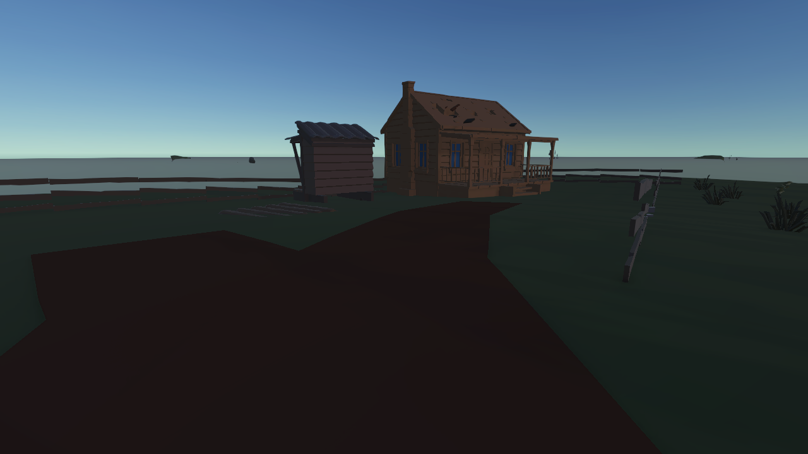

# 한스 농장·인접 숲 구조 조립 후보

- 상태: 커밋 전, 시각 승인 Pending, E 승격 없음.
- 변경: 기존 Graph Map·배치 프로필 결속, 실제 손상 주택 자산·작업 공간·밭·울타리·연속 흙길·식생 조립, 원거리 후보 지면 보존, 수리 울타리 외형 축 보정.
- 검증: 공간 담당 반환의 Unity 한스 집중시험 10/10, 저장·재개방·Play 재진입 중복 없음. 실제 Play 진단 카메라 이미지를 직접 검토했다. 실제 Player 입력·WI 완주·UI 포함 화면은 미검증이다.
- 제한: 어두움·자연 식생·주택 재질·큰 풀·울타리 지주 등 시각 마감은 남는다. 기존 Missing Script 경고 10건은 이번 후보 신규 결함으로 확정하지 않았다.

[승인 범위](../Reports/한스농장-인접숲-자연경관조립-2026-09-05.md) · [초안/수정본 비교와 검증 기록](../Reports/한스농장-자연경관-시각검토-2026-09-05.md)
