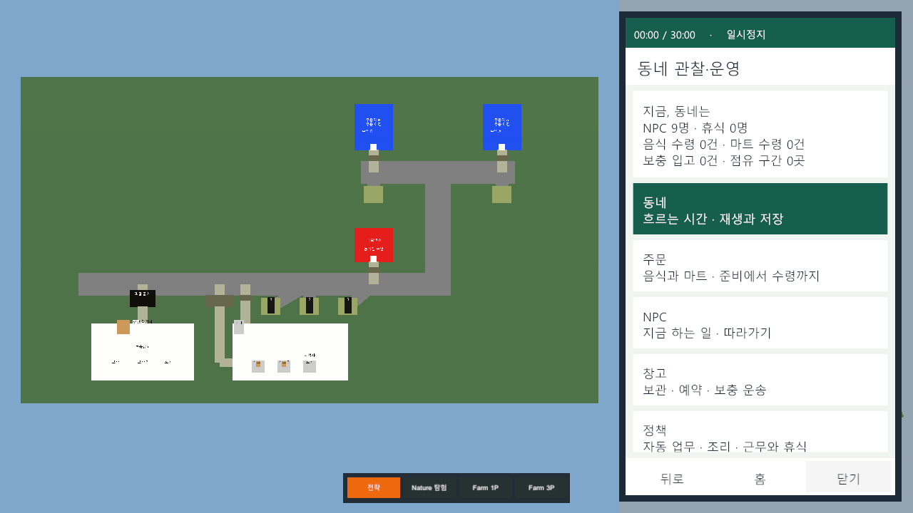

# 동네 관찰·운영 휴대폰

- [승인 기획](../AI/Planning/시스템/PLAN-SYSTEM-MYEONMOK-OBSERVER/observer-phone.r1.md) · [사용법·코드 관계·검증 결과](../AI/Planning/시스템/PLAN-SYSTEM-MYEONMOK-OBSERVER/observer-phone-result.r1.md)
- 새 30분 프로필의 왼쪽 OnGUI를 오른쪽 하단 휴대폰 아이콘과 세로 패널로 교체했다. 동네·주문·NPC·창고·정책 앱, 목록/상세/뒤로/홈/닫기와 카메라 따라가기를 연결했다.
- 기존 도형·역할색·도로·공식 SimulationWorldShell·저장 형식·r1~r4 화면은 유지한다. 별도 Scene/Prefab/외부 자산 추가 없음.
- 코드·.NET 집중 20/20·전체 740/740·기존 회귀 35/35·Unity 컴파일 오류 0·EditMode 8/8 확인. 두 해상도 실제 입력·Game View·정책 초안/적용, 실제30분15.9초 관찰·Tick694/Revision1354 저장 재진입을 확인했다. 저장 지연으로 내부1800 Tick 실시간 완주는 미달이며 저장 비용 개선이 남는다. 커밋·푸시 없음.

## 실제 Play Mode 화면

canonical `SimulationWorldShell`의 별도 검증 슬롯에서 실제 휴대폰 입력 뒤 캡처했다. uGUI를 포함하는 `ScreenCapture.CaptureScreenshot` 원본이며 카메라 단독 렌더가 아니다. 앞 네 장은 최종 소스의 UI 판독 증거이며, 마지막은 30분 실제 관찰 후 저장 재진입 화면이다.

| 화면 | 원본 |
| --- | --- |
| 닫힌 상태·오른쪽 하단 아이콘 | [1280×720](../assets/changes/2026-09-07-observer-phone/final-1280-closed.png) |
| 휴대폰 홈·다섯 앱 | [1280×720](../assets/changes/2026-09-07-observer-phone/final-1280-home.png) |
| 동네 관찰·진행/정지 | [1920×1080](../assets/changes/2026-09-07-observer-phone/final-1920-neighborhood.png) |
| 정책 초안·적용 | [1920×1080](../assets/changes/2026-09-07-observer-phone/final-1920-policy.png) |
| 30분 실제 관찰 후 저장 재진입·11:34 정지 | [1920×1080](../assets/changes/2026-09-07-observer-phone/final-1920-restored.png) |

