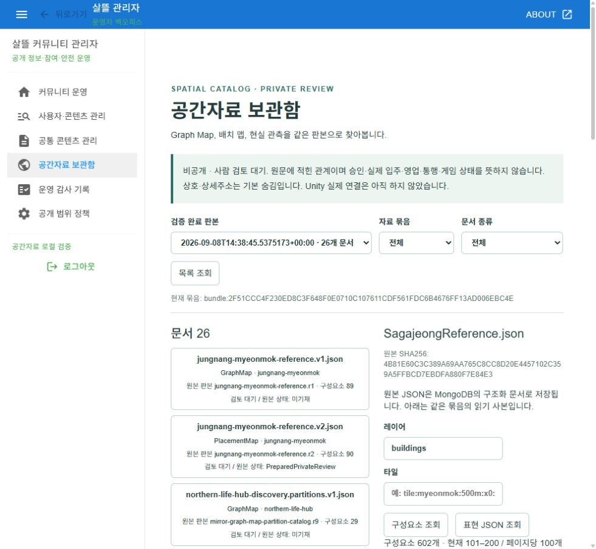

# Mongo 공간자료 보관함

작업 시작 2026-09-08 · 최종 검증 2026-09-09 KST · 커밋 전.

| 커밋 | 변경 축 | 화면 변경 | 시각 증거 |
| --- | --- | --- | --- |
| 미수행 | 원문 JSON→Mongo 판본 사본→관리자 API/웹 조회 | 실제 관리자 `/spatial-catalog` 추가 | 아래 실제 브라우저 화면 |

## 화면과 연결

기존 Graph Map/배치 맵20개와 연관자료6개를 하나의 검토 묶음으로 찾아본다. 문서 종류·판본·구성요소·레이어/타일을 선택하고 같은 판본의 다음 페이지, 명시적 관계, 표현 JSON을 읽는다. 이름·주소는 기본 숨김이며 승인·입주·영업·통행·게임 상태와 구분한다.

실제 빌드된 관리자 앱/Controller/Mongo를 제한 로컬 host에서 확인했다. 캡처는 981×903 원 JPEG를 PNG로 형식만 변환한 것으로 전체 디코드 픽셀 차이0이다. 원 JPEG SHA256 `F84B9089A7A470AB573C00AFFD2168BEE71BD6A9B1366AAAD4FB518FDF50C916`, PNG SHA256 `9D8B6ED82345A70B1CDA19A86E600E49EC4D542F9A738B004999984675973EF2`. 원본은 `artifacts/local/spatial-catalog/20260908-r1/browser/catalog-final.jpg`에 보존했다. 합성·AI 생성·Unity Game View가 아니다.

## 검증과 한계

- 실제 Mongo 26문서/5,115구성요소/3,689명시 관계, 독립 재조회와 동일 입력 신규0.
- 실제 관리자 UI에서 건물602의 100개 페이지 이동과 판본 고정/JSON 잔류 제거 확인. 500+102 전체 조회는 별도 HTTP로 검증했다.
- 신규 시험40 및 기존 관리자4 = 집중44/44 통과. 전체 Task는 변경 범위 밖7실패를 남겼다.
- 임시 검증 신원이며 운영 계정 로그인/주 서버 정상 시작/전체 관리자 앱 회귀가 아니다. 실제 모바일 기기·브라우저 Console 전수·Unity 소비는 미검증.
- 검증용 탭/host는 종료했으며 기존 Mongo 자료는 보존했다. MySQL·Unity·Scene·게임 상태·원문 지도 수정, commit/push 없음.

[구현·실패 목록·근거](../Reports/공간자료-MongoDB-JSON통합-2026-09-08.md) · [저장 구조/API/재현 방법](../Architecture/Mongo공간자료Catalog.md)
