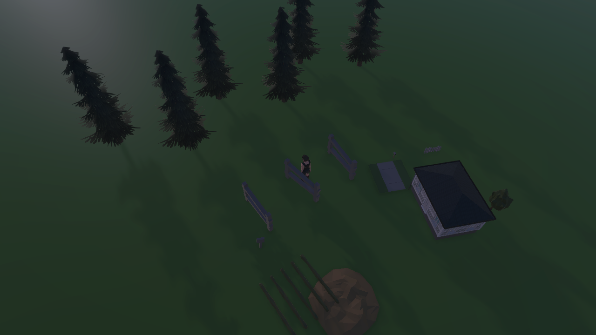

# 한스 농장 월드 화면 정리

## 요청과 기준

사용자는 현재 Unity 화면에 함께 놓인 불필요한 배치를 삭제하고 기획에 필요한 월드맵으로 구성하도록 요청했다. 기준은 [수뢰둔 정본 r4](../AI/Planning/스토리/PLAN-STORY-HEX03-CAMPAIGN-001/README.md)와 [첫 울타리 수리 상세 설계](../Architecture/PlayableLoops/Nature한스농장첫울타리수리.md)다. 이번 작업은 기존 기획의 최소 공간 표현 정리이며, 새 캠페인·권한·H2/H3 시각 완성 승인이나 E 승격이 아니다.

## 유지·정리 범위

| 구분 | 처리 |
| --- | --- |
| 생활주택 H1 한 채, 경작 구획 H1 | 기존 채택 자산을 재사용해 농장 문맥 유지 |
| 울타리 세 구간, 부러진 농장 손도끼, 벌목 대상 | 기존 안정 식별자·권위 상태·상호작용 유지 |
| 이동·귀환 공간, 지지면, 카메라·플레이어·입력·조명 | 삭제 금지, 실제 접지와 가까운 판독 확인 |
| 무관한 반복 건물·타 영역 전시 배치·도로 조각 | 정확한 Scene 경로와 생성 소유자를 확인한 뒤 현재 농장 화면에서 제거 또는 분리 |
| 원본 Prefab·Synty·Blender·다른 영역 소스·Simulation 상태 | 보존 |

## 안전한 작업 순서

1. Editor 점유·Play·dirty 상태와 Scene 계층을 조사한다. 화면만 보고 건물 전체나 도로 전체를 일괄 삭제하지 않는다.
2. 기존 dirty 상태를 포함한 복구용 백업과 제거 대상 목록을 만든다. 저장 Scene과 런타임 생성물을 구분한다.
3. canonical SimulationWorldShell 안에서 최소 농장 조립을 유지한다. 전체 Scene 재생성이나 다른 공식 Scene 신설은 하지 않는다.
4. 자동 생성이 원인이면 한스 프로필의 생성 범위를 제한하고 다른 영역 프로필의 호환성을 보존한다.
5. 재개방·재진입 시 중복 배치, 지면 접촉, 이동·입력과 기존 수리 WI를 확인한다. 실제 화면을 별도 PNG로 남긴다.

## 작업 소유와 현재 상태

- Unity Scene·공간 조립 코드·검증·PNG: 기존 `월드·공간·배치` 담당에게 요청했다.
- 본 스레드: 최신 기획과 정리 범위·반환 결과 통합.
- **씬 정리·저장·재개방·변경 후 실제 Play 화면 확인 완료.** 원본 삭제가 아니라 전시 Root 비활성화와 최소 농장 표현 추가다. 실제 OS 입력·수리 완주·E5 승격은 미검증이다.
- 이전 반환은 직접 중단 지시로 인한 미착수였다. 이후 사용자가 정리 재개와 변경 후 이미지 제공을 명시 승인해 월드 담당에게 재개를 요청했다. 실제 삭제·저장·검증 결과는 반환 후 기록한다.
- 작업 완료 시 제거 목록, 백업 경로, 변경 파일, 검증 결과와 이미지 경로를 이 보고서에 추가한다. 커밋·푸시는 요청하지 않았다.

## 확인된 정리 대상과 복구 사본

- 담당이 확인한 대상은 `/SimulationWorldShell/H계층실증Root_PresentationOnly`다. 하위 `AreaSets_H4_4`에 Renderer 1123개·Collider 841개, `TransitionCorridors_H5_3`에 Renderer 3개가 있으며 반복 건물과 도로/바닥 조각의 전시 문맥을 소유한다.
- 원본 삭제 대신 해당 전시 Root의 저장 활성 상태를 끄는 방식이다. 정확한 저장 결과는 후속 검증으로 확인한다.
- 변경 전 Scene 사본: `C:/Users/user/ssalddel/artifacts/local/validation/hans-world-cleanup-20260905/SimulationWorldShell.before.unity`.
- 변경 전 SHA-256: `D1D31BFDD9A727D1744B888D2AE25D7C275CC9E7F9A6D21EF5FB5CCBDD243271`.
- 주의: 비활성 Root의 Nature/Farm 앵커를 기존 Bootstrap이 참조할 수 있으므로, 지면·집·밭까지 사라지지 않는지 반드시 실제 화면으로 확인한다. 빈 화면을 정리 완료로 간주하지 않는다.

## 최종 반환과 시각 검토

- Unity 변경 파일은 `Assets/Ssalddel/Scenes/SimulationWorldShell.unity` 한 개다. 전시 Root를 비활성화하고 `HansFarmMinimumPresentation`을 기존 사건 기준점에 추가했다. 주택 1채와 2.5m 경작 구획 표시 후보를 기존 자산으로 구성했다. 기존 Presenter가 울타리·도끼를 생성하며 권위 데이터는 변경하지 않았다.
- 저장 후 재개방에서 전시 Root 비활성, 농장 Root 활성과 자식 2개를 확인했다. Play 2회 모두 농장·Nature·한스 울타리 Runtime Root가 각각 하나였다. Console cursor 1805~1861 오류 0, 정상 Stop 후 dirty=false였다.
- 변경 후 Scene SHA-256: `514B241F48309CC1F5A8C00FA242822BD344BD642E239968637B6ACF5F95786E`.
- 촬영은 실제 Play 중 제품의 Nature 진입·탐험 시점 함수를 Pipeline으로 직접 호출했다. 실제 OS 클릭·보행·수리 완주 증거는 아니다.
- 최종 이미지를 직접 검토해 반복 전시 건물/도로 제거와 집·경작 구획·울타리·플레이어·나무의 동시 판독을 확인했다. 현재 시간대가 어두운 점과 경작 구획이 표현 후보라는 한계는 남는다. 권위 시간·날씨나 PNG를 수정하지 않았다.
- 상세 원본: `C:/Users/user/ssalddel/artifacts/local/validation/hans-world-cleanup-20260905/handoff.md`, `manifest.json`.

[정리 전 화면](../assets/changes/2026-09-05-hans-world-cleanup/world-before.png). 중간 빈 화면은 최종 산출물에서 제외했다. H2/H3 시각 확정·E 승격·커밋·푸시는 하지 않았다.
