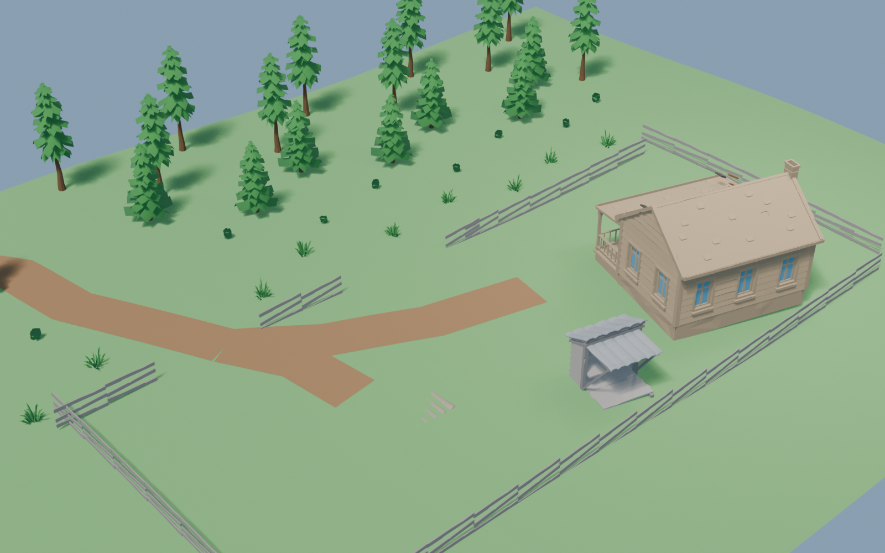
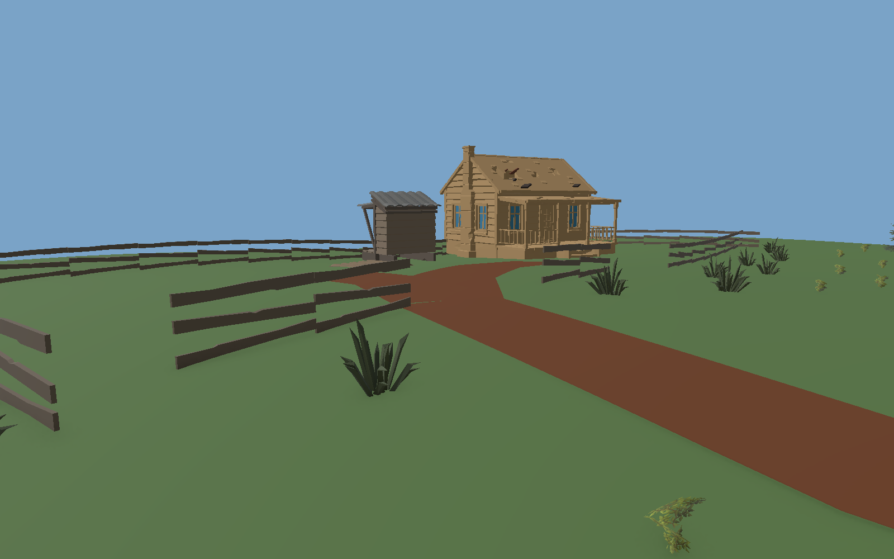

# 한스 농장 자연경관 시각 검토

## 기준

[승인 범위](한스농장-인접숲-자연경관조립-2026-09-05.md)를 구현하는 과정의 검토 기록이다. 승인 문서의 결속 hash를 바꾸지 않도록 실행 검토를 분리했다. H2/H3 채택 및 Evidence 승격 기록이 아니다.

## 첫 후보 검토 — 수정 필요

Unity 프로젝트 `ArtSource/Blender/AreaSet-배치초안/숲경계-한스-생활농장/r5-natural-world/`의 `blender-overview-v3.png`와 `unity-static-overview.png`를 직접 검토했다. 후자는 Prefab 정적 검토 이미지이며 실제 Game View가 아니다.

- 도로 조각 사이가 끊겨 있으며 Blender 도로 일부가 솟은 형태로 보인다. 지표면과 자산 축·단위를 대조해야 한다.
- 경계 울타리 측면과 모서리에 틈이 남아 있다. 프리팹 길이와 끝점에 근거한 배치 및 기존 수리 세 구간의 실제 연결 검토가 필요하다.
- 밭이 지면에 묻힌 듯 보이며 2.5×2.5m 경작 구획을 읽기 어렵다.
- Blender 나무의 색 무늬, Unity 주택의 백색 재질이 의도와 맞지 않는다. 원본 재질 슬롯·텍스처 대응을 보존해야 한다.
- 현재 식생은 개별 나무가 떨어져 있어 밀집 숲에서 농장으로 이어지는 경관 전이가 부족하다.

따라서 첫 후보는 최종 배치로 채택하지 않는다. 기존 이미지와 자산은 비교 이력으로 보존한다.

## 수치 검사와 화면 검토의 구분

첫 배치 검사 결과는 `CanStage=true / ErrorCount=0 / WarningCount=0`이다. 그러나 주택 지지면의 높이 편차는 약 0.598m이며, 검사 통과만으로 접지·계단 통행·연속 경계의 시각 품질을 입증하지 못한다.

추가 검토 항목은 canonical 지형과 후보 지형의 중복 여부, 현재 배치·지표면·자산 hash의 일치, 주택 Collider의 현관 통행, 검토용 조명 설정 복원이다. 공간 담당에게 현재 승인 범위 안의 보정을 요청했다.

## 상태

구조 조립 후보 r3의 canonical Scene 적용·실제 Play 진단 화면·저장 재개방·재진입 검증까지 반환받았다. 최종 자연경관 마감·실제 Player 보행·WI 통합 완료는 아니다. 커밋·푸시는 하지 않았다.

## 수정 후보 r3 직접 검토

연속된 흙길과 열린 출입구를 표현했으며, 첫 후보의 흩어진 도로 조각과 잘못된 나무 색 무늬가 개선됐다. Unity 주택의 백색 재질도 개선됐지만 원본 손상집의 재질색과 완전히 일치하지는 않는다. Blender 식생은 전용 셰이더를 그대로 재현한 것이 아니라 잎·줄기 의미를 구별한 중립 검토색이다.

위 Unity 이미지는 정적 Prefab 검토 렌더로, 실제 Game View를 대신하지 않는다. 울타리 지주와 접지의 판독성, 자연 식생 군집 및 주택 재질 마감은 남아 있다. 구조 조립 후보와 최종 자연경관 채택을 분리하며 H2/H3 채택과 E 승격은 하지 않는다.

## 실제 Play 진단 화면에서 발견한 차이

`artifacts/local/validation/hans-farm-adjacent-forest-20260905/`의 `unity-gameview-open-entry-route-diagnostic.png`와 `unity-gameview-farm-1p-facing-farm-diagnostic.png`를 직접 검토했다. 주택과 경계는 보이지만 정적 r3에서 보이던 길과 밭이 실제 화면에서는 제대로 드러나지 않는다. 지표면/배치 높이/실행 중 지형의 불일치 여부를 공간 담당에게 검토·보정 요청했다. 원인이 확정되기 전 지면 매몰이라고 단정하지 않는다.

따라서 정적 후보를 실제 World 배치 성공으로 승격하지 않는다. `unity-gameview-farm-3p.png` 또한 실제로는 숲만 보이므로 파일명과 무관하게 농장 또는 3인칭 플레이 성공 증거에서 제외한다.

## 지면 결손 보정과 최종 반환

위 진단 이후 공간 담당은 중앙 지형이 한스 농장 위치를 덮지 않는데도 후보 지면을 제거하던 처리를 수정했다. 기존 지형을 평탄화하지 않고 해당 위치의 비평탄 후보 지면을 보존했다. 최종 실제 Play 이미지에서 길·경작 구획·주택·경계를 직접 확인했다.

화면은 실제 Play 중 진단 카메라로 촬영했으며 촬영 후 카메라를 복원했다는 공간 담당 반환을 받았다. 실제 Player 이동 입력·UI overlay 검증을 대신하지 않는다. 어두운 판독성과 시각 마감은 남는다.

| 항목 | 반환 결과와 경계 |
| --- | --- |
| Unity 집중시험 | 한스 농장 10/10 통과: Presenter 4 + 조립 6 |
| 저장·재개방·Play 재진입 | 후보 1, 후보 지면 1, 연속 경로 3; 중복 없음 |
| 지지면·진입 단면 | 경로 96점 지지/차단 없음, 반지름 0.34m 진입 단면 25/25 clear; 실제 Player 왕복 증거 아님 |
| 수리 울타리 | 권위 root 3개 보존, 외형 child 축 보정, 인접 XZ 간격 약 0.192m/0.189m |
| Console | 마지막 재진입 관찰 구간 신규 error 0; 기존 Missing Script 경고 10은 남음 |
| Graph·배치 프로필 | Graph r2, profile revision 5와 기획 r25를 계보로 결속; 시각 승인 Pending 유지 |
| 종료 | Editor stopped/compile false, canonical Scene dirty false |

최종 Scene SHA-256: `9CD701402E809B5E1B0BF2C578A5F1965413C468F7DCE3440FA464818EE983E4`.

Unity 프로젝트의 `artifacts/local/validation/hans-farm-adjacent-forest-20260905/handoff.md` 및 `manifest.json`이 상세 반환 근거다. 해당 내부 파일 8개와 외부 참조 5개의 SHA-256을 본 스레드에서 재검증했다.

아직 남은 범위는 자연 식생 밀도, 큰 풀의 크기, 주택 재질, 울타리 지주 판독성, 밝기, OS 실제 보행·UI, Farm Session/WI 통합과 LH 장기 통합이다. H2/H3 시각 채택과 E 승격은 하지 않는다.

기존 공통 검사 두 건은 개발 담당이 기존 변경을 보존한 채 새 정확 판본·hash·실제 Graph 노드·배치 참조·이전 계보를 검사하도록 보완했다. `forest-edge-farm-placement-asset-survey.ps1` 및 `spatial-design-knowledge.ps1`는 통과했다. `UnapprovedCandidate / Pending / Unity=0 / E4PreparationOnly` 조건을 유지했으며 실제 씬 관찰을 승인 원장의 자동 승격으로 연결하지 않았다.
