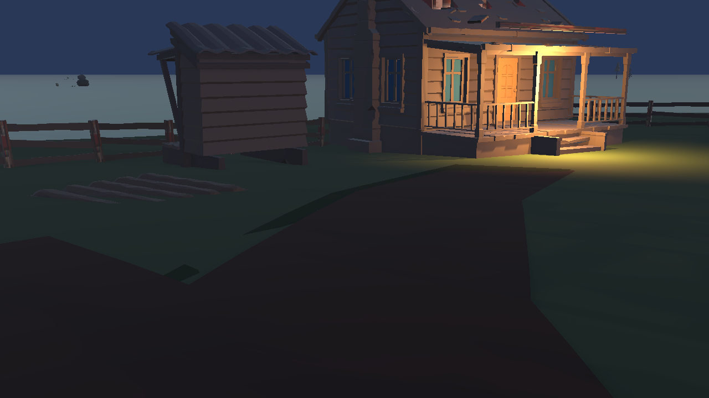

# 한스 농장 정교한 양식화 — 구현·검증

## 승인과 기준선

- 승인 기획: [PLAN-VISUAL-HANS-FARM-001 r1](../AI/Planning/표현/PLAN-VISUAL-HANS-FARM-001/README.md)
- 기획 SHA-256: `9840C56585A142EC45B22D1949B16AFF2E73E5049956EB38B8EF8CA86CD634E8`
- 이전 결과: [자연경관 구조 후보 r3](한스농장-자연경관-시각검토-2026-09-05.md)
- 대상: 기존 공식 Scene의 한스 주택·마당·진입로·울타리·밭과 인접 식생. 전체 월드·Simulation·애니메이션·새 자산 구매는 제외한다.

## 현재 진행

승인 정본과 기획 목차를 등록했다. 개발 담당은 기존 WI20 작업명세의 `presentationE4Preparation.supportingPlanningRefs`에 표현 지원 기획을 결속했으며 기존 planningGate·WI·단계는 유지했다. 명세 검사는 Logic E5 / Presentation E4 / Integrated E4 / PromotionEligible False로 통과했다.

공간 담당은 별도 `r6-refined-stylized` 파생 자산과 단독 Editor 작업을 소유한다. 공통 Presenter는 이번 작업에서 추가 수정하지 않고 외형 child/파생 prefab을 우선한다. 본 보고·CURRENT_WORK·PLANNING은 기획 스레드가 소유한다.

## 원본 재질 조사

기존 손상 주택 제작 스크립트의 `make_atlas_material`은 원본 텍스처와 UV를 사용하며, `assign_review_materials`는 본체 atlas와 Glass를 구분한다. 지붕/벽이 반드시 서로 다른 객체나 재질 슬롯인 것은 아니다. 따라서 이름만으로 지붕을 찾거나 전체를 갈색 단색으로 덮는 방식을 반복하지 않는다. Blender의 절차형 풍화 노드가 FBX로 동일하게 전달됐다고 가정하지 않고 Unity 표현을 별도 확인한다.

## 완료 판정

### 중간 시각 검토에서 재개한 항목

- 첫 r6 Blender 눈높이 렌더에서 추가 처마 보가 집 밖으로 과하게 돌출되고 판자가 현관 앞에 분리되어 보였다. 실제 주택 축·Bounds에 맞는 접점 보정을 요청했으며 이 렌더는 채택 근거로 사용하지 않는다.
- 경로 가장자리 복사본이 원본과 같은 mesh data를 공유한 채 재질을 교체하여 원본 흙길까지 녹색으로 바꾸는 문제가 제작 스크립트에서 확인됐다. 복사본의 mesh data를 독립시키고 원본부터 재생성하도록 전달했다.
- URP Point Light의 큰 강도 값은 실제 렌더에서 과노출 여부를 확인해야 한다. 조명 변경 효과와 모델·재질 개선은 비교 증거에서 구별한다.

## 사용자 요청에 따른 범위 마감

토큰 사용을 줄이기 위해 사용자가 추가 개선보다 현재 작업 마감을 요청했다. 새로운 개선·렌더 반복은 중단하며 시각 완성을 선언하지 않는다.

- 구현 후보: `Hans농장정교한양식화Authoring.cs`, 파생 재질, 울타리 기둥·길 경계·식생 크기·현관 조명, Blender `r6-refined-stylized` 파일과 렌더.
- 최종 담당 반환: Unity 컴파일 완료, Hans 농장 집중시험 17/17 통과. canonical Scene은 저장·재개방 후 clean/stopped/root2이며 Editor 점유를 반환했다. Scene SHA-256은 `6976565CBAEE8AE8637397E8EC21674E6FF8C63D14E5EC7D34333FD4E518BC96`이다.
- 확인한 오류 조회: `console-after-final-play.json` 최종 Play 이후 조회 Error 0. 프로젝트 전체 무오류 보장은 아니다.
- 성능 참고: 변경 후 Editor Play 단일 관측 CPU 5.7914ms, GPU 0.745472ms, draw call 866. 동일 조건 변경 전 수치가 없어 개선·회귀 판정에 사용하지 않는다.
- 마지막 Unity 진단 캡처를 직접 확인했다. 집·울타리·길과 현관 조명이 보인다. 실제 Player 입력·WI 완주·성능 비교는 미검증이다.
- 최종 담당 반환에서 공중 loose board 3개 제외, fascia 접점·Bounds와 길 shared mesh 문제 보정, 현관 조명 강도/범위 60/8 조정을 확인했다. 잔여 사항은 어두운 전체 화면·각진 길·낮 팔레트와 미관 검토다. 정교한 양식화의 최종 품질 승인은 보류하며 추가 개선은 별도 재개한다.
- 시각 채택·E 승격·커밋·푸시 없음. 기획 승인 정본의 hash는 유지하며 실행 중단 상태는 이 보고와 목차에만 기록한다.

로컬 원본은 `C:/Users/user/ssalddel/artifacts/local/validation/hans-farm-refined-stylized-r1/`에, Blender 파생본은 `C:/Users/user/ssalddel/ArtSource/Blender/AreaSet-배치초안/숲경계-한스-생활농장/r6-refined-stylized/`에 보존한다.
